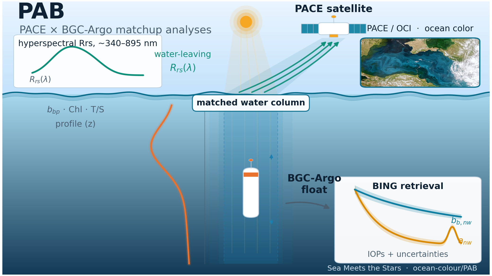

<div align="center">

<a href="https://github.com/Sea-Meets-the-Stars">
  
</a>

# PAB

**PACE and BGC-Argo matchup analyses**

[](https://github.com/ocean-colour/PAB/actions/workflows/ci.yml)
[](https://pab.readthedocs.io/en/latest/)

A [Sea Meets the Stars](https://github.com/Sea-Meets-the-Stars) project.

</div>

<picture>
  <source media="(prefers-color-scheme: dark)" srcset="docs/figures/pab_summary_dark.png">
  
</picture>

## Overview

**PAB** produces matchup analyses between **PACE** (satellite ocean color) and
**BGC-Argo** (autonomous float) data, and shares the results with the community.

The package ties together two independent views of the upper ocean. BGC-Argo
floats deliver in-situ vertical profiles — particulate backscatter (`bbp`),
chlorophyll-a, salinity, and temperature — from which PAB derives a per-profile
mixed-layer summary. NASA's PACE/OCI mission delivers hyperspectral
remote-sensing reflectance, `Rrs(λ)`, from space. PAB matches float profiles to
PACE granules in space and time, extracts the ~10 `Rrs` spectra nearest each
float, and runs **BING** — a Bayesian retrieval — on those spectra to recover
the inherent optical properties (non-water absorption, particulate
backscattering, and phytoplankton absorption) together with their
uncertainties. The retrieved IOPs, figures, and tables are published as summary
reports for the community.

The end-to-end pipeline is:

1. **Fetch and process BGC-Argo data** (via `argopy`): Q&A plots, mixed-layer
   depth (MLD), and mixed-layer `bbp`, Chl-a, salinity, and temperature.
2. **Match BGC-Argo profiles to PACE granules** in space and time.
3. **Extract the ~10 Rrs spectra** nearest each float from the PACE granules.
4. **Run BING** on the extracted spectra to retrieve IOPs and their
   uncertainties, with the associated figures and tables.
5. **Produce summary reports** — figures, tables, and text — published to
   Read the Docs.

The data layer is built behind thin, dataset-specific loaders, so additional
in-situ archives and other satellites can be added later without disturbing the
matchup and analysis code. Core scientific machinery is reused from existing
packages: **BING** (Bayesian IOP retrieval), **ocpy** (ocean-color utilities),
**argopy** (BGC-Argo access), and **remote_sensing** (Earthdata Cloud access).

## Documentation

The developer and methods documentation is built with Sphinx and published on
Read the Docs: **https://pab.readthedocs.io**

To build it locally:

```bash
pip install -r requirements.txt
sphinx-build -b html docs docs/_build/html
```

See [`docs/dev_setup.rst`](docs/dev_setup.rst) for the full developer setup, and
the design docs under [`docs/design/`](docs/design/) (design, coding plan, and
implementation record).

The summary graphic above is a "light's journey" cross-section — PACE measuring
water-leaving radiance from above while a BGC-Argo float profiles the same
water column below, matched and passed to BING for the IOP retrieval. It is
generated by [`docs/scripts/pab_graphic.py`](docs/scripts/pab_graphic.py), which
writes both a dark ("hero") and a light variant for talks and slides. The
"what PACE sees" inset uses a public-domain PACE/OCI ocean-color image (see
[`docs/figures/assets/CREDITS.md`](docs/figures/assets/CREDITS.md)).

## Developers

- **J. Xavier Prochaska**
- **Allie James**
