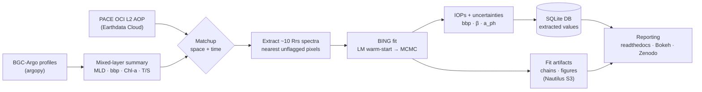
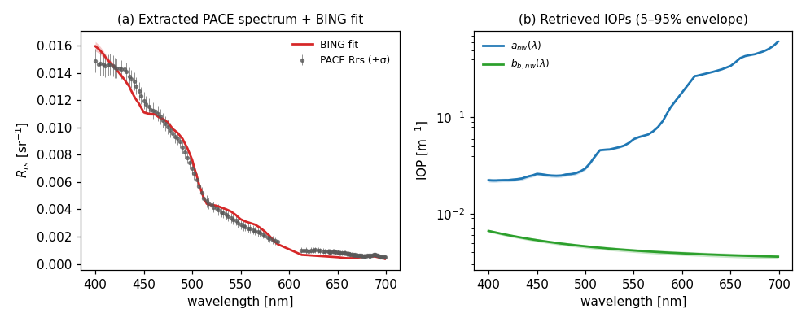
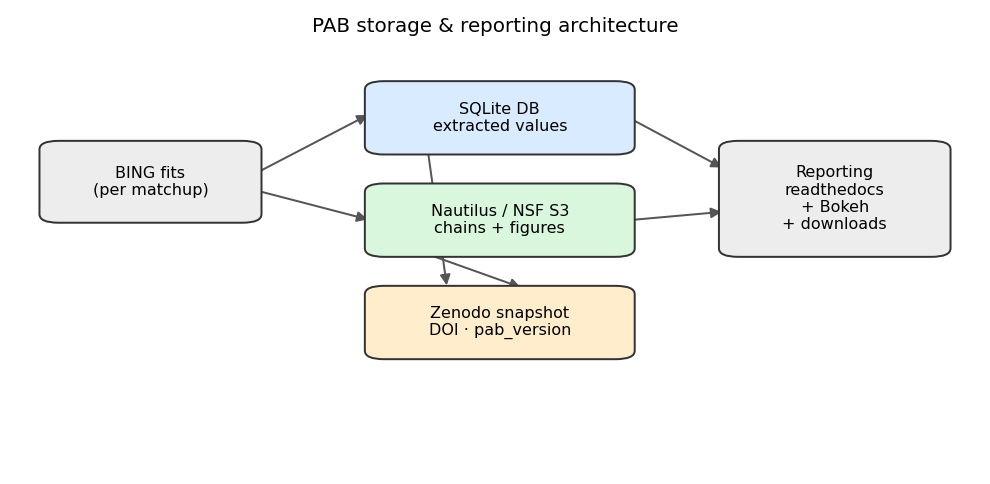

# PACE and BGC-Argo Matchup Analysis Design Document

**Version:** 0.4.3
**Date:** 2026-06-23
**Authors:** JXP and Claude

**Versioning convention:** bump the **minor** version for substantive changes
(new or rewritten sections), e.g. 0.2 → 0.3; use an **additional decimal** for
small edits, e.g. 0.2 → 0.2.1. Update the **Date** whenever the version changes.

---

## Preamble

This document describes the design and requirements of **PAB**, a Python package for **matchup analyses between PACE satellite ocean-color observations and BGC-Argo autonomous-float data**.

### Purpose

This is the guiding reference for the development of the PAB package. It
captures *what* the package must do and *how* its pieces fit together, so that
implementation can proceed against a shared, agreed design.

- It is a **design document**, not a code specification: it deliberately avoids
  specific code recommendations (function signatures, class hierarchies, etc.).
  A separate document will cover implementation details.
- It is a **living document**. Sections will be added and revised as the design
  matures; the version number at the top will be incremented accordingly.

### Scope and goals

PAB is intended to, at minimum:

- **Fetch and process BGC-Argo data** (via `argopy`): perform Q&A with plots,
  compute and record the mixed-layer depth (MLD) when not supplied, measure and
  tabulate `bbp` and Chl-a within the mixed layer, and record average salinity
  and temperature in the mixed layer.
- **Match BGC-Argo profiles to PACE granules** in space and time.
- **Extract the ~10 Rrs spectra** nearest each float from the PACE granules for
  IOP analysis.
- **Run BING** on the extracted spectra to retrieve the inherent optical
  properties (IOPs: non-water absorption and particulate backscattering) and
  their uncertainties, and generate the associated figures and tables.
- **Produce summary reports** of the matchup analysis — figures, tables, and
  text — published to readthedocs.io via `.rst` files.

The package should also provide **hooks to incorporate additional in-situ
datasets and other satellites** in the future, rather than hard-coding the
PACE/BGC-Argo pair.

### Architecture overview

The end-to-end pipeline ties the sections of this document together: Data
(BGC-Argo + PACE), Analysis (BING fits), and Reporting.

***Figure 1.*** *PAB end-to-end dataflow: from BGC-Argo profiles and PACE
granules, through space/time matchup and per-spectrum BING retrieval, to the
SQLite store of extracted values, the bulky fit artifacts on object storage, and
the community-facing reporting layer. (Mermaid diagram; renders on GitHub and on
readthedocs via the mermaid extension.)*

### Relationship to other documents and packages

- A distilled reference of the source material (the BING paper, the Bisson et
  al. matchup papers, and the argopy / PACE / earthaccess documentation) is
  maintained in [`docs/context.md`](../context.md). The design draws on it
  throughout.
- Core scientific machinery is reused from existing packages: **BING**
  (Bayesian IOP retrieval), **ocpy** (ocean-color utilities, dataset loaders),
  **argopy** (BGC-Argo access), and **remote_sensing** (Earthdata Cloud granule
  discovery/access and generic ocean-color L2 helpers).

### Conventions

- Wavelengths in nanometres (nm); IOPs in m⁻¹; `Rrs` in sr⁻¹.
- Argo variables referred to by their standard uppercase names (e.g. `CHLA`,
  `BBP700`, `PSAL`, `TEMP`, `PRES`).
- Dates in ISO format (YYYY-MM-DD).

---

## Data

PAB is organized around **two primary datasets**: BGC-Argo float profiles and
PACE/OCI satellite ocean color. NASA's own PACE L2 IOP product is carried as a
secondary baseline for comparison. The data layer is deliberately built behind
thin, dataset-specific *loaders* so that additional in-situ archives and
satellites can be added later without disturbing the matchup and analysis code
(see *Extensibility hooks*).

Wherever a loader already exists in the **ocpy**, **argopy**, or
**remote_sensing** packages (all on this workstation), PAB reuses it rather than
reimplementing I/O. The entry points named below are the intended seams between
PAB and those packages.

### Datasets at a glance

| Dataset | Role | Type | Key variables | Access path | Loader / API |
|---|---|---|---|---|---|
| **BGC-Argo** | Primary (in-situ truth) | Float vertical profiles | `BBP700`, `CHLA`, `PSAL`, `TEMP`, `PRES` | argopy → Ifremer ERDDAP | `argopy.DataFetcher(ds='bgc', src='erddap')`; `argopy.ArgoIndex(index_file='bgc-s')` |
| **PACE / OCI L2 AOP** | Primary (satellite) | Hyperspectral L2 granules | `Rrs(λ)`, `Rrs_unc(λ)`, `l2_flags`, `nflh` | NASA Earthdata Cloud (OB.DAAC) | `earthaccess` (search/open) → `ocpy.pace.io.load_oci_l2*` |
| **PACE / OCI L2 IOP** | Secondary (NASA baseline) | Hyperspectral L2 granules | `a`, `bb`, `aph`, `bbp_442`, `adg_*` | NASA Earthdata Cloud (OB.DAAC) | `ocpy.pace.io.load_iop_l2` |
| **Future** (other in-situ archives, MODIS/VIIRS/OLCI, other satellites) | Hooks | — | — | TBD | new loader modules |

### Dataset descriptions

**BGC-Argo (primary in-situ).** Autonomous biogeochemical floats reporting
vertical profiles of particulate backscatter at 700 nm (`BBP700`),
chlorophyll-a (`CHLA`), salinity (`PSAL`), temperature (`TEMP`) and pressure
(`PRES`), among >120 BGC parameters. These provide the in-situ truth for the
matchup: PAB derives a per-profile mixed-layer summary (averaged, de-spiked
`bbp` and `CHLA`; mean `PSAL`/`TEMP`) following the Bisson et al. (2019)
recipe documented in `docs/context.md`.

**PACE / OCI L2 AOP (primary satellite).** Hyperspectral (~340–895 nm, ~172
bands on the `wavelength_3d` axis) Level-2 remote-sensing reflectance granules
at ~1 km resolution (`PACE_OCI_L2_AOP`, v3.1, OB.DAAC). Each pixel carries
`Rrs(λ)`, its uncertainty `Rrs_unc(λ)`, normalized fluorescence line height
(`nflh`/`FLH`), and a per-pixel `l2_flags` bitmask for quality screening. The
~10 spectra nearest each float are the inputs to BING.

**PACE / OCI L2 IOP (secondary).** NASA's own L2 IOP retrieval
(`a`, `bb`, `aph`, `bbp_442`, `bbp_unc_442`, `adg_442`, `adg_s`, `bbp_s`). Used
as an independent baseline to compare against BING-retrieved IOPs (mirrors the
GIOP-vs-BING comparison in the BING `papers/biomass` analysis).

### Loading

PAB does not re-implement file parsing; it calls existing loaders:

- **BGC-Argo** — `argopy.DataFetcher` configured with `ds='bgc'`,
  `src='erddap'` (the only source supporting BGC), and a user `mode`
  (`'standard'` for routine work, `'research'` for delayed-mode, QC=1 data when
  high quality matters, e.g. MLD). Data are selected with `.region([...])`,
  `.float(WMO)`, or `.profile(WMO, cyc)`, and narrowed with the BGC-only
  `params=` (variables to return, e.g. `['CHLA','BBP700']`) and `measured=`
  (variables required non-NaN) keywords. `.load().data` returns an
  `xarray.Dataset`; `.index` returns a profile-listing `DataFrame`.
- **PACE AOP** — **the primary intention is to read PACE data directly from the
  NASA Earthdata Cloud, not from local granule files.** PAB runs on a workstation
  in the **AWS `us-west-2`** region (where the OB.DAAC PACE archive lives) with
  an Earthdata Login already configured, so in-region cloud access is the design
  target. `ocpy` already provides granule readers that operate on a file on a
  hard drive (`ocpy.pace.io.load_oci_l2(fn)` → an `xarray.Dataset` of `Rrs`,
  `Rrs_unc`, `FLH` with `latitude`/`longitude`/`wavelength` coords plus raw
  `l2_flags`; and, for single-spectrum extraction, `load_oci_l2_spectrum(fn,
  target_lat, target_lon)` which finds the nearest pixel by squared lat/lon
  distance and reads **only** that spectrum off disk, and
  `load_oci_l2_spectrum_pixel(fn, ix, iy)`). In PAB these file-based readers are
  used mainly for **debugging and development**; the operational path discovers
  granules via `earthaccess` and reads the needed pixels straight from the cloud
  (see *Cloud access* and *Storage and retrieval*). The nearest-pixel logic is
  the same — only the data source (cloud vs. disk) differs — so the cloud reader
  reuses/extends the existing `ocpy` extraction rather than duplicating it.
- **PACE IOP** — `ocpy.pace.io.load_iop_l2(fn)` (same cloud-first treatment).

### Processing

The processing each dataset receives before matchup/analysis:

- **BGC-Argo:** reshape points→profiles (`ds.argo.point2profile()`); apply QC
  filtering (`ds.argo.filter_qc(QC_list=[1,2,...])` and data-mode filtering);
  **compute the mixed-layer depth (MLD)** when not provided — the de Boyer
  Montégut density-threshold criterion (depth where potential density `SIG0`
  exceeds its 10 m value by 0.03 kg m⁻³), using `ds.argo.teos10([...,'SIG0'])`
  for density and a per-profile reducer; **de-spike** `BBP700` within the MLD
  with a 3-point moving median (removes bubble spikes); then **average**
  `BBP700` and `CHLA` and record mean `PSAL`/`TEMP` within the MLD. This yields
  one summary record per profile.
- **PACE AOP:** apply `mask_and_scale` (the stored Rrs are scaled integers);
  screen pixels with the standard ocean `l2_flags` mask (`ATMFAIL`, `LAND`,
  `HIGLINT`, `HILT`, `STRAYLIGHT`, `CLDICE`, `COCCOLITH`, `HISATZEN`,
  `HISOLZEN`, `LOWLW`, `CHLFAIL`, `NAVFAIL`, `MAXAERITER`); select the nearest
  **unflagged** pixel(s); optionally assess box homogeneity (Bisson: skill
  degrades where Rrs spatial variability is high). The PACE measurement-noise
  vector for fitting is available via
  `ocpy.satellites.pace.gen_noise_vector(wave)`. Generic OC L2 helpers in
  `remote_sensing.netcdf.oc` (`create_quality_mask`, `quality_control`,
  `extract_rrs_spectrum`, `find_rrs_variables`) provide an alternative,
  sensor-agnostic path for the `l2_flags` masking and spectrum extraction.
- **Granule quality assessment.** For each matchup, PAB computes and records a
  quality summary of the relevant PACE scene: the **percentage of flagged
  pixels** (over the granule and over the local matchup box), a **breakdown by
  flag** with the **dominant flagging reason** (e.g. `CLDICE`, `HIGLINT`,
  `ATMFAIL`), and the count of valid pixels available near the float. These
  granule-QC fields are stored in the SQLite database alongside the matchup
  record so the population can be screened/stratified by scene quality and so
  poor scenes are flagged in reporting. (Decoding the `l2_flags` bitmask via its
  `flag_meanings`/`flag_masks` attributes gives the per-flag tallies.)

### Matchup, use, and analysis

The two primary datasets are joined into **matchup records**: for each
qualifying BGC-Argo profile, find PACE granules within a small spatial box
(e.g. a 5×5-pixel window per Bisson et al.) and a tight time window of the
profile, extract the ~10 nearest valid Rrs spectra, and pair them with the
float's mixed-layer summary. Each matchup record then flows to the **Analysis**
layer (later section): BING fits the spectra to retrieve `a_nw(λ)` and
`b_b,p(λ)` with uncertainties, and the retrieved `bbp` is compared against the
float `BBP700` (the robust matchup observable identified by the BING paper) and
against the NASA L2 IOP baseline.

### Cloud access (PACE)

PAB targets **in-region access from AWS `us-west-2`**, where the OB.DAAC PACE
archive resides and an Earthdata Login is already configured on the workstation.
Granule *discovery* is uniform — a CMR query by short name, bounding box, time
window, and cloud-cover range (`earthaccess.search_data(...)`); the
`remote_sensing.download.earthaccess` module already wraps this pattern (e.g.
`query_modis_oc`, and `build_granule_table`, which turns the returned granules
into a `DataFrame` of id / footprint polygon / time / cloud-cover / data URL —
directly useful for spatially matching granules to a float position).

For *reading* the data without downloading whole granules, two mechanisms are
under consideration (final choice deferred — see Q&A):

- **(a) Lazy `xarray` open over S3.** In-region, the granule is opened as a
  remote object and only the requested bytes are fetched, so a nearest-pixel
  read transfers a single spectrum rather than the full cube. The mechanics are
  the standard NASA Earthdata Cloud pattern: obtain temporary S3 credentials for
  the DAAC and open the object through an `s3fs` filesystem
  (`xr.open_dataset(s3sys.open(url), engine='h5netcdf')`), or equivalently
  `earthaccess.open(results)` which returns ready file-like objects. The
  `remote_sensing` package already implements exactly this for PO.DAAC/SWOT
  (`remote_sensing.process.swot_ssh_utils.init_S3FileSystem` +
  `xr.open_dataset(s3sys.open(fn, mode='rb'))`), and notes it requires running
  in `us-west-2` — the same approach repoints cleanly at the OB.DAAC PACE bucket.
  *Pros:* reuses the existing `ocpy`/`remote_sensing` readers unchanged (only the
  file handle is a remote object); full control over pixel selection and QC;
  fastest in-region. *Cons:* you still open the granule's coordinate/variable
  metadata (and chunk-level reads), so efficiency depends on the file's internal
  chunking; needs S3 credential handling.
- **(b) OPeNDAP server-side subsetting.** OB.DAAC exposes granules via a Hyrax
  OPeNDAP endpoint (an `OPENDAP DATA`-subtype URL in the granule's
  `RelatedUrls`; `remote_sensing.download.podaac` already distinguishes this
  subtype). The server returns only the requested variable and index slice, so
  the client transfers just the pixels asked for. *Pros:* minimal transfer;
  works the same in- or out-of-region; no S3 credential plumbing. *Cons:*
  per-request server-side latency and endpoint reliability; index-based subsetting
  still needs the lat/lon arrays first to locate the nearest pixel; behavior can
  vary by product.

A reasonable plan is to start with **(a)** (it maximizes reuse of the existing
in-region readers) while keeping the granule-discovery and pixel-selection steps
factored so **(b)** can be slotted in as an alternative backend.

### Storage and retrieval

A layered local layout (paths configurable; large raw data kept out of the
repo) is proposed:

- **Cloud-first raw access (no bulk download).** PACE granules are located and
  read from the **NASA Earthdata Cloud** via **`earthaccess`**
  (`earthaccess.login()` → `earthaccess.search_data(short_name="PACE_OCI_L2_AOP",
  temporal=..., bounding_box=..., cloud_cover=...)` → cloud read of the matched
  granules). **PAB deliberately avoids downloading full L2 granules except for
  debugging and development**; the routine workflow reads only the pixels needed
  for each matchup from the cloud (`earthaccess.download(...)` for whole granules
  is reserved for offline development). On the Argo side, argopy fetches from
  ERDDAP with its own cache (`argopy.set_options(cachedir=...)`), and the
  `argopy.ArgoIndex(index_file='bgc-s')` BGC index enables a fast **index-first**
  spatial/temporal pre-selection of floats before any data transfer.
- **Database of extracted values (`SQLite`).** All *tabular, extracted* values
  are stored in a **SQLite** database — the chosen backend. This includes the
  per-profile mixed-layer summaries (de-spiked/averaged `bbp`, `CHLA`, mean
  `PSAL`/`TEMP`, MLD), the profile↔granule↔pixel matchup index, and the scalar
  IOP results extracted from the BING fits (e.g. posterior median and credible
  intervals for `Bnw`/`β`/`bbp`, `a_ph`, etc.) keyed to each matchup. SQLite
  gives a single-file, zero-server source of truth with a schema, indexed and
  relational queries, and atomic updates, while remaining trivially shareable and
  exportable to CSV/Parquet for inspection. Expected scale — up to ~10⁴ Argo
  profiles and ~10× as many analyzed PACE spectra (~10⁵ rows) — is comfortably
  within SQLite's single-user range.
- **Fit outputs in files (keyed by ID).** The *bulky, non-tabular* BING outputs
  — MCMC chains and the generated figures — are **not** stored in the database;
  they live as separate files (e.g. NPZ/JSON for chains/posteriors, PNG/PDF for
  figures) under a structured directory, each keyed by a matchup/fit ID that
  references the corresponding database row. The database thus holds the
  extracted numbers and provenance; the files hold the heavy artifacts.

Retrieval is therefore two-tiered: heavyweight raw data are read on demand from
the cloud/ERDDAP (and only minimally cached), while the extracted values are
queried from the SQLite database and the fit artifacts are loaded from disk by
ID for analysis, plotting, and reporting.

#### Discussion: why a database (SQLite) over CSV look-up tables

The `papers/biomass` precedent stores matchup look-up tables as **CSV** (e.g.
`matched_argo_bgc_profiles_bbp.csv`). CSV is easy to read by eye and needs no
dependencies, which is valuable during exploration, but is **not ideal for
programmatic use**: there is no enforced schema or typing; relational links
between profiles, granules, pixels, and fit outputs must be maintained by hand
across multiple files; queries (e.g. "all matchups in a region/season with a
valid `bbp` and an unflagged spectrum") require loading whole files into pandas;
and incremental updates risk desynchronization.

**Decision:** PAB adopts **SQLite** for the extracted-value tables. It supplies
the schema, indexed/relational queries, and atomic updates CSV lacks, while
staying embedded (a single `.db` file, no server) and shareable — a good fit for
the single-user/collaborator scale above. CSV/Parquet remain available as
*exports* for human inspection and sharing, not as the system of record.
Alternatives considered and deferred: **DuckDB+Parquet** (stronger for large
columnar analytics, worth revisiting if the spectrum-level tables grow much
larger) and **PostgreSQL** (warranted only if PAB later becomes a shared,
concurrently-updated community archive). To keep that door open, the storage
layer should sit behind a thin interface so the backend can change without
touching the matchup/analysis code.

### Extensibility hooks

To satisfy the goal of *future in-situ datasets and other satellites*:

- **A common matchup record schema** (location, time, in-situ summary,
  spectrum/IOPs, provenance) so any in-situ source that can produce a
  location/time/`bbp`-or-`Rrs` record can be matched against any gridded
  satellite product.
- **Loader registry** — each dataset is wrapped by a small loader exposing a
  uniform interface (discover → fetch/cache → load → standardize to the common
  schema); adding another in-situ archive or satellite means adding a loader, not
  editing the matchup/analysis code.
- **Satellite abstraction** — the nearest-pixel extraction and `l2_flags`-style
  QC are expressed generically (lat/lon arrays + spectral axis + quality mask),
  building on the sensor-agnostic OC helpers in `remote_sensing.netcdf.oc` and
  the granule-query/table tools in `remote_sensing.download.earthaccess`, so
  MODIS/VIIRS/OLCI (already partly supported in `ocpy.satellites` and
  `remote_sensing`) or future sensors can be substituted for PACE.

---

## Analysis

The analysis layer turns the matchup records (a float mixed-layer summary plus
the ~10 nearest PACE `Rrs` spectra) into retrieved IOPs with uncertainties, and
the diagnostics, figures, and tables that follow. It **follows the scientific
approach of `bing/papers/biomass/Analysis`** but with three deliberate changes
requested for PAB: (1) **semi-automation** of the end-to-end run; (2)
**provenance and versioning** of every input and output; and (3) **community
exposure** of the results (at least viewable BING figures).

> **Code-reuse principle.** PAB will **not use any of the code in
> `bing/papers/biomass/Analysis`.** Those scripts are a *reference* for the
> scientific workflow only; PAB will take what it needs from them conceptually
> and implement **entirely new modules** in the `pab` package. The distinction
> matters: PAB *does* depend on the installable **BING package** API
> (`bing.models`, `bing.fitting`, `bing.evaluate`, `bing.rt`, …) and on `ocpy`,
> `argopy`, and `remote_sensing`; it does *not* import or adapt the one-off
> `papers/biomass` analysis scripts.

### Reference workflow (conceptual template — not reused code)

The biomass paper drives its pipeline (in `end_to_end_workflow.py`) as numbered
stages: slurp Argo profiles → build the PACE granule list → match PACE to Argo
(`dtime='1 day'`) → locate the closest granule with good `Rrs` → fit with BING →
slurp the fits back into a table → add the Argo mixed-layer `bbp`. PAB adopts
this *staging* as a conceptual blueprint and reimplements each stage anew; the
Data section already covers the early stages (discovery, matchup, cloud Rrs
extraction). This section details the **fitting and post-fit** stages.

### Rrs source: PACE L2 AOP or PAB-derived from L1B

The fit consumes an `Rrs(λ)` spectrum and its per-band uncertainty. By default
these come from the **PACE L2 AOP** product (`Rrs`, `Rrs_unc`; see Data). PAB,
however, must also **allow deriving `Rrs` and its uncertainty from PACE Level-1B
data with our own algorithms** — i.e. running an in-house
atmospheric-correction / Rrs-estimation step on L1B radiances rather than
accepting NASA's L2 retrieval. The design therefore treats the Rrs source as a
**pluggable upstream stage**: whether `Rrs(λ)`/`σ_Rrs(λ)` arrives from the L2
product or from a PAB L1B→Rrs algorithm, it feeds the *same* fitting pipeline,
and its provenance (source = `L2_AOP` vs `PAB_L1B:<algorithm/version>`) is
recorded with the fit. This keeps the door open to experimenting with custom
atmospheric corrections and uncertainty models without changing the downstream
analysis.

### The BING fit (per spectrum)

For each extracted `Rrs(λ)` spectrum (restricted to 400–700 nm for PACE), BING
is driven through its standard two-stage pipeline:

1. **Initialize models** — `bing.models.utils.init([anw_name, bbnw_name],
   wave)` returns the `[a_nw, b_b,nw]` model pair. **PAB runs a single model pair
   for now: `ExpBricaud` + `Pow`** (exponential CDOM+detritus, Bricaud
   phytoplankton, power-law backscatter) — confirmed as the default. The code
   base must nonetheless be **prepared for additional model pairs** (BING's
   library is broad — `anw`: `Cst`, `Exp`, `ExpBricaud`, `GIOP`, `GSM`, `Chase`,
   …; `bbnw`: `Cst`, `Pow`, `Lee`, `GSM`, …), so the pair is a configurable
   choice rather than hard-coded.
2. **Set priors** — per-model `bing.priors.Priors` (the standard/`default`
   prior set), which also impose the parameter bounds.
3. **Least-squares warm-start** — `bing.fitting.chisq_fit.fit(item, models)`
   (Levenberg–Marquardt) for a fast initial guess. A failed LM fit is recorded
   and the spectrum is skipped.
4. **MCMC posterior** — `bing.fitting.inference.init_mcmc(models, nsteps,
   nburn)` then `fit_one(item, models, pdict)` (emcee) to obtain the full
   posterior chains. PAB keeps BING's standard MCMC settings (`nsteps≈10000`,
   `nburn≈1000`, 16 walkers); batches of spectra run via `fit_batch` (parallel
   across cores).
5. **Reconstruct + summarize** — `bing.evaluate.calc_stats(chains)` for
   posterior medians and 5th/95th (and 68%) percentiles, and
   `bing.evaluate.reconstruct_from_chains(models, chains, rt_dict)` to propagate
   the chains into `a_nw(λ)`, `b_b,p(λ)`, and reconstructed `Rrs(λ)` with
   uncertainty envelopes. The forward model is Gordon's relation in
   `bing.rt.rrs` (with optional Raman / chlorophyll-fluorescence terms).

The retrieved quantity of primary interest is **`bbp`** (amplitude `Bnw` and
slope `β` from the `Pow` model) — the robust matchup observable per the BING
paper — alongside `a_ph`, `a_dg`, and their uncertainties.

***Figure 2.*** *A real example BING fit (a `papers/biomass` matchup, float
6903823/profile 387). **(a)** the extracted PACE `Rrs(λ)` spectrum with its
per-band uncertainty and the BING reconstructed fit + uncertainty envelope;
**(b)** the retrieved non-water IOPs `a_nw(λ)` and `b_b,nw(λ)` with their 5–95%
posterior envelopes. Generated by [`docs/scripts/fig_example_fit.py`](../scripts/fig_example_fit.py).
(A fuller single-matchup schematic would add the float `bbp(z)` profile with the
MLD marked and the PACE pixel neighborhood; those panels need the raw Argo
profile and the PACE granule — see Q&A.)*

**Output naming schema.** Because PAB is built to support more than one model
pair over time, every retrieved quantity is namespaced by the algorithm and
model that produced it, e.g. `BING_ExpBPow_bbp`, `BING_ExpBPow_beta`,
`BING_ExpBPow_aph`, … (and `BING_ExpBPow_bbp_unc` for uncertainties). A second
model pair would write parallel columns (e.g. `BING_GIOP_bbp`) without
colliding, and the NASA baseline stays under its own prefix (e.g.
`NASA_L2IOP_bbp`).

### Diagnostics

PAB fits the **single fixed model pair** (`ExpBricaud`+`Pow`) for now;
**automated model selection is not in scope** (N/A for now). The information
criteria remain available as *diagnostics* but are not used to choose a model.

- **Goodness of fit** — `bing.stats.calc_chisq` (reduced χ²) per spectrum.
- **Information criteria (reported, not selected on)** — `bing.stats.calc_ICs`
  (AIC/BIC) recorded per fit for reference. (A future capability could fit a
  ladder of model pairs and auto-select via ΔBIC, as in the BING paper, but PAB
  will not do this initially.)
- **Convergence** — chain thinning/burn-in via `evaluate.thin_burn_chains`; PAB
  should additionally record basic convergence indicators (acceptance fraction,
  autocorrelation/effective sample size) as QC on each fit.

### Comparison & metrics

Each matchup yields three estimates of backscatter that PAB compares:
**BING `bbp`** (this analysis), **NASA L2 IOP `bbp`** (the secondary baseline,
`bbp_442`/`bbp_s`), and the **in-situ Argo `bbp`** (mixed-layer, de-spiked).
**Chlorophyll is compared the same way:** BING **retrieves** Chl from the fitted
phytoplankton amplitude `Aph` (for the Bricaud family, `Chl = 10**Aph / 0.05582`)
— the `Chl` passed in only *seeds* the `a_ph` shape, it is **not** a fixed input —
so the BING Chl is compared against the in-situ Argo `chla` (with an OC4
band-ratio Chl available as an independent cross-check). The matchup metrics are
defined here (PAB has no separate Metrics section; the metrics live with the
Analysis layer). They follow the comparison used in the
BING `papers/biomass` analysis and in Bisson et al. (2019), which compare
satellite vs. float `bbp` in log space:

- **Ratio** — the satellite/in-situ ratio `bbp_sat / bbp_float`, summarized by
  its **median** (Bisson et al. found a median satellite/float ratio of
  0.77–1.66 across sensors/algorithms) and interquartile spread.
- **Rank correlation** — **Spearman** ρ between satellite and float `bbp`
  (rank-based, robust to the log-normal spread of `bbp`).
- **Log-space bias & scatter** — bias = mean of `log10(bbp_sat/bbp_float)`;
  scatter = RMS (or MAD) of the same residual; reported alongside the log-log
  scatter plot with 1:1 and median-ratio offset lines (cf.
  `figs_biomass.fig_giop_vs_bnw_colored`).
- **Per-fit goodness of fit** — the reduced χ² from each BING fit (above),
  carried as a per-matchup quality field.
- **BING vs. NASA L2 IOP** — the same statistics computed between the two
  satellite retrievals, to separate algorithm differences from
  satellite-vs-float differences.

All metrics are computed across the matchup population and **stratified by
region, season, and `Rrs` spatial variability** (Bisson's caveat that skill
degrades where `Rrs` is spatially variable), and written to the SQLite store for
the reporting layer.

### Figures & tables

- **Per-fit figure** — the spectral fit + residuals and a posterior corner plot.
  PAB generates **one figure per matchup** (its own plotting module, informed by
  BING's `bing.plotting.show_fits` and the biomass `plot_fit`/`mini_corner`
  *concepts* — not their code). Target **~100 KB per figure** rather than the
  ~1 MB the biomass scripts produce (e.g. lower DPI, rasterized panels, PNG
  optimization / `optimize=True`, or trimmed panel count), which keeps the full
  set tractable to expose.
- **Scene quick-look (per matchup)** — a small PNG of the PACE scene around the
  float for visual inspection. The default is a **false-color RGB composite** of
  the granule neighborhood: `Rrs` at three wavelengths (default R/G/B ≈
  645/555/470 nm, configurable) mapped to the colour channels and scaled by a
  **shared brightness reference** (+ gamma) so the natural blue-dominant ocean
  colour is preserved (rather than per-channel stretching, which amplifies
  retrieval noise into speckle on near-uniform open-ocean scenes); cloud/glint
  artefacts and water-colour gradients are then obvious at a glance, with a
  single-band/`Rrs` view (with a colorbar)
  remains available. Either carries the **Argo float location marked** and the
  **pixels actually extracted and analyzed** highlighted, plus the `l2_flags`
  mask shown (flagged pixels greyed). This makes the granule-quality assessment
  (above) visually checkable — one can see whether the float sat under cloud/
  glint and which pixels fed the fit. Kept small (~100 KB) like the fit figure.
- **Population figures** — satellite-vs-float `bbp` scatter, BING-vs-NASA-L2-IOP
  comparison, maps, and metric distributions (new PAB plotting code).
- **Tables** — the extracted scalar results (posterior medians/intervals for the
  namespaced quantities `BING_ExpBPow_bbp`, `…_beta`, `…_aph`, `…_adg`; χ²; IC
  values; convergence flags) are written to the **SQLite** store defined in the
  Data section, keyed by matchup ID, and exportable to CSV for inspection and to
  `.rst` for reporting.

### Semi-automation

PAB provides its **own** single, resumable, semi-automated pipeline (new code,
not the biomass scripts): a stage runner (discover → match → extract → fit →
summarize → tabulate) where each stage is idempotent and skips already-completed
work (a `clobber=False`-style guard), reads its inputs from and writes its
outputs to the matchup store, and can be run for a single matchup (debugging) or
the full population (batch, parallel). Heavy fits run via BING's `fit_batch`
across cores.

### Provenance & versioning

To make every result reproducible and inspectable, each fit record should
capture its full provenance:

- **Inputs** — granule ID/URL and pixel indices, float WMO/cycle, matchup
  distance and Δtime, wavelength range, the noise model used, and the **Rrs
  source** (`L2_AOP` vs `PAB_L1B:<algorithm/version>`).
- **Configuration** — the chosen `a_nw`/`b_b,nw` model names, the prior set,
  MCMC settings (`nsteps`, `nburn`, walkers), and the forward-model options
  (Raman/fluorescence on/off).
- **Environment** — versions of BING, ocpy, argopy, remote_sensing (and the PAB
  git commit), so a result can be tied to the exact code that produced it.

**Versioning schema (decided): a `pab_version` string.** Every fit is stamped
with a `pab_version` and a `created` timestamp, and outputs are stored under a
path/ID that encodes the matchup and `pab_version`. Re-running under a new
`pab_version` produces a new record rather than silently overwriting, enabling
side-by-side comparison of algorithm/prior changes across versions.

### Outputs & community exposure

Per the Data section, the **extracted scalar values live in the SQLite
database** and the **bulky artifacts (MCMC chains as NPZ/JSON, figures as
PNG/PDF) live in files keyed by matchup/fit ID.**

On exposing the BING figures: PAB plans to expose **one figure per matchup**, so
the count is set by the number of matchups (design target ~10⁴), not by the
~10⁵ analyzed spectra. At the **~100 KB target** size (above), the full set is on
the order of ~1 GB — modest enough that figure size is **not a major concern for
now**. A single such file is well within GitHub's limits (it warns above 50 MB,
blocks above 100 MB). Guidance for the implementation:

- **Keep the figures small** — the ~100 KB target (vs the biomass scripts'
  ~1 MB) is an explicit design goal; achieve it via reduced DPI, rasterized
  panels, and PNG optimization.
- **Prefer readthedocs (and/or an external store) over bloating git history.**
  Even at ~1 GB, committing the full set into the main repo's git history is
  best avoided; render/serve figures through the readthedocs build or an
  external object store (an `us-west-2` S3 bucket), since the database + retained
  chains make any figure **regenerable**.

The broader question of *what else* to expose to the community (extracted-value
tables, raw chains, an interactive query interface, and whether to add a data
release such as Zenodo alongside readthedocs) is **deferred to the Reporting
section**, per JXP.

### Q&A

JXP's answers to the initial Analysis questions have been folded into this
section. The remaining open item — the full set of community-facing products and
channels — is **carried forward to the Reporting section**. Any further
questions are recorded in the **Analysis → Q&A** section of
`claude_prompts/design_prompts.md`.

---

## Reporting

Reporting is, by JXP's framing, **possibly the most important component of PAB**:
giving the community **quick-look yet comprehensive** views of the matchup
results through a **web interface**, plus the ability to **download both the
summary statistics and the fits** for further analysis. The analysis layer has
already produced the raw materials — the SQLite store of extracted values and
the per-matchup fit artifacts (chains + ~100 KB figure), each stamped with a
`pab_version`. Reporting turns those into navigable, citable products.

### Products

1. **Static site on readthedocs.io (`.rst` → Sphinx).** The primary channel, and
   **fully static** (sufficient for now; a server-backed app is deferred unless
   usage grows — see *Architecture & build*). PAB **generates `.rst`
   programmatically** from the SQLite database and fit artifacts (a templated
   reporting module). A key constraint (per JXP): **PAB does *not* render one
   page per matchup** — at ~10⁴ matchups that page explosion is unwanted, and
   even per-float pages would be nearly as costly. Instead the site is a small,
   fixed set of **aggregate** pages, with individual-matchup detail reached
   **on demand** via the interactive figures (see tier 2) rather than
   pre-rendered. Content:
   - a **landing / summary page** (what PAB is, dataset coverage, counts, the
     headline satellite-vs-float `bbp` comparison and key metrics);
   - **aggregate result pages** — population and binned views (by region, season,
     `bbp` magnitude, `Rrs` variability) with summary plots and **sortable
     statistics tables**, not per-object pages;
   - **spatial aggregation via HEALPix (to try).** In addition to the
     region/season bins, PAB will trial **HEALPix** equal-area spatial cells:
     matchups are binned into HEALPix pixels and the per-cell statistics
     (median `bbp`, ratio vs float, counts, …) drive a map and a compact
     per-cell table. This gives a resolution-tunable, equal-area aggregation
     that scales independently of matchup count, and can reuse the existing
     **`remote_sensing.healpix`** tooling (`rs_healpix`, `combine`, `utils`).
     The flat region/season binning (above) is the default for now; HEALPix is
     an alternative aggregation to evaluate alongside it;
   - **methods / algorithm pages** describing the pipeline and citing the BING
     and Bisson references.
2. **Interactive figures (Bokeh) — the route to per-matchup detail.** Embedded in
   the site as **standalone Bokeh** HTML/JSON (`bokeh.embed`) so they work on
   static readthedocs hosting without a live server. These carry the per-matchup
   information that is deliberately *not* given its own page:
   - a **map** of matchup locations and **satellite-vs-float `bbp`** /
     **BING-vs-NASA-L2-IOP** scatter, colored by metric, with **hover** showing
     each matchup's key values (IOPs + uncertainties, float context, distance/
     Δtime, `pab_version`) and **click/tap** linking to that matchup's figure and
     downloadable artifacts in the object store (by ID) — so detail is fetched
     on demand instead of rendered into thousands of pages;
   - 1:1 / median-ratio guides and linked filtering by region, season, float,
     and `Rrs` spatial variability.
   The per-matchup metadata for hover/lookup is exported once from the database
   into a compact table (e.g. CSV/JSON/ColumnDataSource) the figures load. At
   ~10⁴–10⁵ points, large scatter/maps use WebGL (`output_backend="webgl"`) or
   server-side rasterization (Datashader) to stay responsive.
3. **Downloads.** The three product types JXP wants exposed (the raw SQLite
   database file is *not* a published download), all linked from the site:
   - **(a) Summary-statistics tables** — the extracted-value tables exported
     from SQLite to **CSV/Parquet**, for easy reuse in pandas.
   - **(c) Per-matchup MCMC chains (NPZ)** — the full posteriors.
   - **(d) Per-matchup figures** (~100 KB each).
   The bulky (c)/(d) artifacts are served from an **object store** (below), not
   git, keyed by `pab_version` and matchup ID. A **download manifest** (table of
   IDs → URLs + checksums) ties downloads back to the database rows.
4. **Citable data release (Zenodo).** Periodic versioned snapshots — the
   summary-table export plus a manifest of the fit artifacts — published to
   **Zenodo** for a DOI, pinned to a `pab_version`. readthedocs carries the
   living view; Zenodo carries the frozen, citable record.

**Object store for bulk artifacts: NSF/Nautilus S3.** The downloadable chains
and figures (too large for git) are hosted on the **Nautilus S3-compatible
object storage** maintained by NSF (the National Research Platform), not on AWS.
Note this means compute runs in-region on AWS `us-west-2` (Data section) while
*distribution* artifacts are pushed to Nautilus S3; the reporting build writes
artifacts there and records their URLs in the manifest.

### Additional items the community would likely want

- **Searchable/filterable matchup index** — a single interactive, queryable
  table (by float WMO, date, region, quality) whose rows link to the matchup's
  figure/artifacts in the object store, **in lieu of** per-matchup pages.
- **Region (and optionally season) aggregate pages** with links out to the
  source **PACE granule** (OB.DAAC) and **BGC-Argo float dashboard** (e.g.
  argopy's `.dashboard()` / Euro-Argo fleet-monitoring URL). Per-float *pages*
  are avoided (too many); per-float *filtering* is provided in the interactive
  table/figures instead.
- **Reproducibility hooks** — record the inputs, `pab_version`, and package
  versions, and note that any figure is regenerable from the stored chains;
  ideally a one-line "how to reproduce this fit" snippet (keyed by matchup ID).
- **Quality/coverage dashboard** — counts and maps of attempted vs. successful
  fits, flagged spectra, and convergence QC, so users can judge completeness.
- **Machine-readable metadata / API** — a STAC-like JSON index or a small query
  endpoint so others can programmatically discover matchups (longer-term).

### Architecture & build

The reporting module reads the **SQLite DB** (numbers) and the **fit artifact
store** (chains/figures on Nautilus S3), renders the fixed set of aggregate
`.rst` pages + embedded standalone Bokeh via Sphinx, and publishes to
readthedocs; tagged snapshots go to Zenodo. The build is **driven off
`pab_version`** so a site always reflects a known analysis version.

- **Cadence:** for now the site is produced by a **manual pipeline run**, with
  possible migration to an automated (CI-triggered) build later.
- **Audience:** the **ocean-color science community**, so framing is pitched at
  domain scientists — emphasize methods, IOPs/uncertainties, and quantitative
  comparison rather than introductory explanation.
- **Hosting model:** **fully static** (no server to operate); a server-backed
  interactive app (Bokeh-server/Panel with live DB queries) is deferred and
  would only be considered if the site becomes heavily used.

***Figure 3.*** *PAB storage & reporting architecture: BING fits feed the SQLite
database (extracted values) and the Nautilus/NSF S3 object store (chains +
figures); periodic Zenodo snapshots provide citable, `pab_version`-pinned
releases; the reporting layer (readthedocs + standalone Bokeh + downloads) reads
from both stores. Generated by
[`docs/scripts/fig_architecture.py`](../scripts/fig_architecture.py).*
