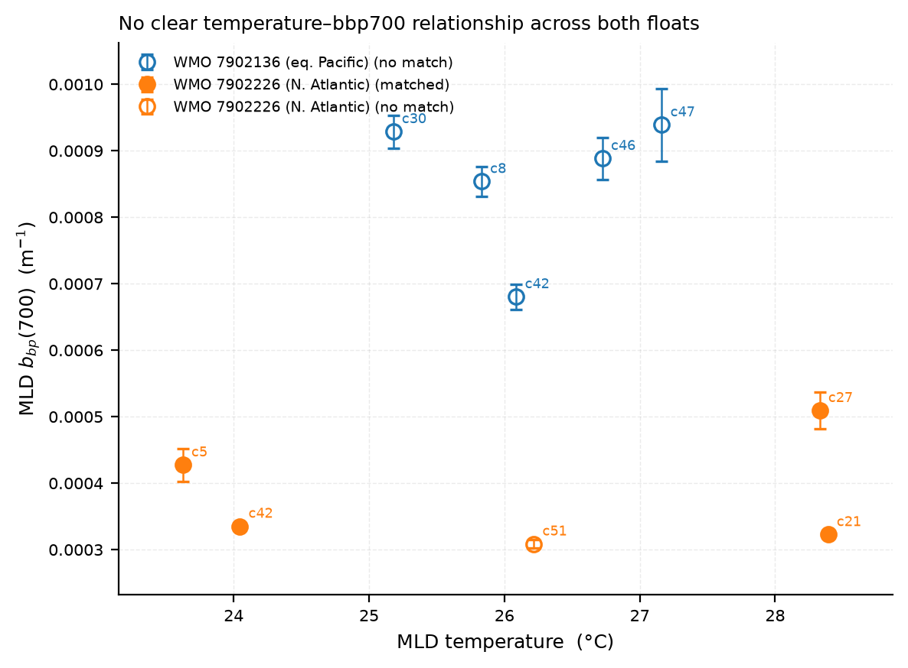

# Argo MLD bbp700 vs. Temperature

**Date:** 2026-07-30  
**Floats:** WMO 7902136 (equatorial Pacific), WMO 7902226 (subtropical N. Atlantic)  
**Profiles:** n = 10 (all profiles with MLD summaries)  
**Script:** `pab/matchup/plot_bbp700_vs_temp.py`

---

## Figure



*Each point is one BGC-Argo profile. Error bars are ±1 standard deviation of
bbp700 within the mixed layer. Filled markers = cycles with a PACE matchup;
open markers = no matchup. Cycle numbers are annotated beside each point.*

---

## What the figure shows

Both the mixed-layer temperature and bbp700 are derived from the BGC-Argo
float profiles — no satellite data are used here. The figure spans two
contrasting oceanographic regimes:

- **WMO 7902136** (blue) — equatorial Pacific, ~3–4°N, 131–137°W.
  Temperature 25–27 °C. bbp700 0.00068–0.00094 m⁻¹.
- **WMO 7902226** (orange) — subtropical North Atlantic, ~24–27°N, 46–54°W.
  Temperature 23–28 °C. bbp700 0.00031–0.00051 m⁻¹.

Within each float, there is no consistent monotonic relationship between
temperature and bbp700. Across both floats, the Pacific float is
systematically higher in bbp700 (mean 0.00086 m⁻¹ vs 0.00038 m⁻¹ for the
Atlantic float). The Pacific float spans 25.2–27.2 °C and the Atlantic float
23.6–28.4 °C; despite this substantial overlap in temperature, bbp700 remains
consistently ~2.3× higher in the Pacific, confirming that optical regime —
not temperature — drives the difference.

---

## Data

All values come from `mld_summary` in `pab.db`, joined with `profiles`
for position and time.

| WMO | Cycle | Temp (°C) | bbp700 (m⁻¹) | bbp700 std (m⁻¹) | Chl-a (mg m⁻³) | Matched |
|------:|------:|----------:|-------------:|------------------:|---------------:|:-------:|
| 7902136 |  8 | 25.83 | 0.000854 | 0.000022 | 0.947 | No  |
| 7902136 | 30 | 25.18 | 0.000929 | 0.000025 | 1.060 | No  |
| 7902136 | 42 | 26.09 | 0.000681 | 0.000019 | 0.843 | No  |
| 7902136 | 46 | 26.72 | 0.000889 | 0.000031 | 0.727 | No  |
| 7902136 | 47 | 27.16 | 0.000939 | 0.000055 | 0.566 | No  |
| 7902226 |  5 | 23.62 | 0.000427 | 0.000025 | 0.091 | Yes |
| 7902226 | 21 | 28.39 | 0.000323 | 0.000005 | 0.044 | Yes |
| 7902226 | 27 | 28.33 | 0.000509 | 0.000028 | 0.052 | Yes |
| 7902226 | 42 | 24.05 | 0.000335 | 0.000005 | 0.035 | Yes |
| 7902226 | 51 | 26.22 | 0.000309 | 0.000007 | 0.035 | No  |

bbp700 and bbp700_std are the de-spiked mean and standard deviation within
the mixed layer (de Boyer Montégut 0.03 kg m⁻³ density criterion).

---

## How to reproduce

```bash
python pab/matchup/plot_bbp700_vs_temp.py \
    --db /path/to/pab.db \
    --out bbp700_vs_temp.png
```

Or from Python:

```python
from pab.db.store import Store
from pab.matchup.plot_bbp700_vs_temp import plot_bbp700_vs_temp

with Store.open("pab.db", create=False) as store:
    fig = plot_bbp700_vs_temp(store)

fig.savefig("bbp700_vs_temp.png", dpi=200, bbox_inches="tight")
```

---

## Full script (`pab/matchup/plot_bbp700_vs_temp.py`)

```python
"""Scatter of Argo MLD bbp700 vs. mixed-layer temperature for all profiles.

One point per profile, error bars = ±1 std within the mixed layer.
Filled markers = cycles with a PACE matchup; open = no matchup.
Two floats shown in different colors.

Usage
-----
    python pab/matchup/plot_bbp700_vs_temp.py --db /path/to/pab.db
"""

from __future__ import annotations

import argparse
from pathlib import Path

import matplotlib as mpl
import matplotlib.pyplot as plt
import numpy as np

PAB_DB_DEFAULT = Path("/Users/alliejames/Documents/summer 2026/data/PAB/pab.db")


def _parse_args(argv=None):
    p = argparse.ArgumentParser(description=__doc__)
    p.add_argument("--db", type=Path, default=PAB_DB_DEFAULT)
    p.add_argument("--out", type=Path, default=Path("bbp700_vs_temp.png"))
    p.add_argument("--dpi", type=int, default=200)
    return p.parse_args(argv)


def plot_bbp700_vs_temp(store, *, outfile=None, dpi: int = 200):
    df = store.query_df("""
        SELECT p.wmo, p.cycle, p.time,
               ms.bbp700, ms.bbp700_std, ms.temp, ms.chla,
               CASE WHEN m.matchup_id IS NOT NULL THEN 1 ELSE 0 END AS has_matchup
        FROM profiles p
        JOIN mld_summary ms ON ms.profile_id = p.profile_id
        LEFT JOIN matchups m ON m.profile_id = p.profile_id
        ORDER BY p.wmo, p.time
    """)

    wmos = sorted(df["wmo"].unique())
    cmap = mpl.colormaps["tab10"]
    wmo_colors = {w: cmap(i) for i, w in enumerate(wmos)}
    wmo_names = {
        7902136: "WMO 7902136 (eq. Pacific)",
        7902226: "WMO 7902226 (N. Atlantic)",
    }

    fig, ax = plt.subplots(figsize=(6, 4.5))

    for wmo_id in wmos:
        sub = df[df["wmo"] == wmo_id]
        col = wmo_colors[wmo_id]
        matched = sub[sub["has_matchup"] == 1]
        unmatched = sub[sub["has_matchup"] == 0]

        for grp, is_matched in [(matched, True), (unmatched, False)]:
            if grp.empty:
                continue
            lbl = wmo_names[wmo_id] + (" (matched)" if is_matched else " (no match)")
            ax.errorbar(
                grp["temp"], grp["bbp700"], yerr=grp["bbp700_std"],
                fmt="o", color=col,
                markerfacecolor=col if is_matched else "none",
                markeredgecolor=col, markeredgewidth=1.2,
                ms=7, elinewidth=0.9, capsize=3, capthick=0.9,
                label=lbl, zorder=4,
            )

        for _, row in sub.iterrows():
            ax.annotate(
                f"c{int(row['cycle'])}",
                xy=(row["temp"], row["bbp700"]),
                xytext=(4, 4), textcoords="offset points",
                fontsize=6.5, color=col, zorder=5,
            )

    ax.set_xlabel("MLD temperature  (°C)", fontsize=9)
    ax.set_ylabel(r"MLD $b_{bp}(700)$  (m$^{-1}$)", fontsize=9)
    ax.set_title(
        "No clear temperature–bbp700 relationship across both floats",
        fontsize=9, loc="left", pad=6,
    )
    ax.tick_params(labelsize=7.5, direction="out")
    ax.spines["top"].set_visible(False)
    ax.spines["right"].set_visible(False)
    ax.grid(alpha=0.25, linewidth=0.5, linestyle="--")
    ax.legend(fontsize=7, frameon=False, loc="upper left")
    ax.margins(0.1)
    fig.tight_layout()

    if outfile is not None:
        outfile = Path(outfile)
        fig.savefig(outfile, dpi=dpi, bbox_inches="tight")
        plt.close(fig)
        print(f"Saved -> {outfile}")
        return outfile
    return fig


def main(argv=None):
    args = _parse_args(argv)
    from pab.db.store import Store
    with Store.open(args.db, create=False) as store:
        plot_bbp700_vs_temp(store, outfile=args.out, dpi=args.dpi)


if __name__ == "__main__":
    main()
```

---

## Notes

- With n = 10 points across two very different ocean regimes, no statistical
  test for a temperature–bbp700 relationship is warranted.
- Within WMO 7902226 (Atlantic), bbp700 is highest at cycle 27 (28.3 °C)
  and lowest at cycle 51 (26.2 °C), but the spread is small and within
  measurement uncertainty.
- Within WMO 7902136 (Pacific), bbp700 dips at cycle 42 (26.1 °C, 0.00068 m⁻¹)
  relative to flanking cycles, with no clear temperature driver.
- The between-float bbp700 difference (~2.3×) at overlapping temperatures
  reflects distinct biogeochemical regimes (productive equatorial upwelling
  vs. oligotrophic subtropical gyre) rather than a temperature effect.

---

## References

- de Boyer Montégut, C. et al. (2004). Mixed layer depth over the global
  ocean. *Journal of Geophysical Research: Oceans*, 109(C12).
