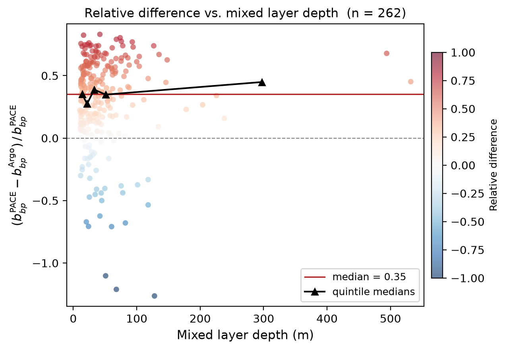
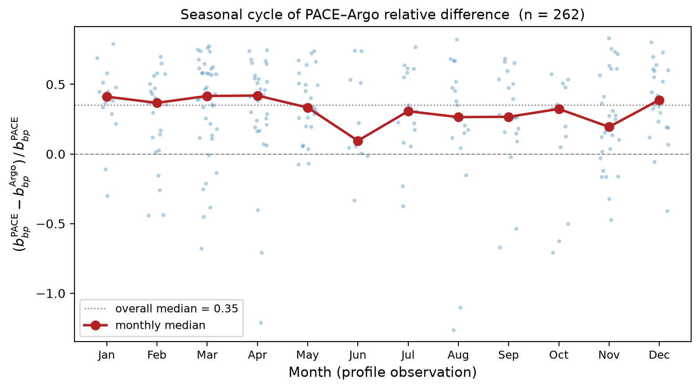
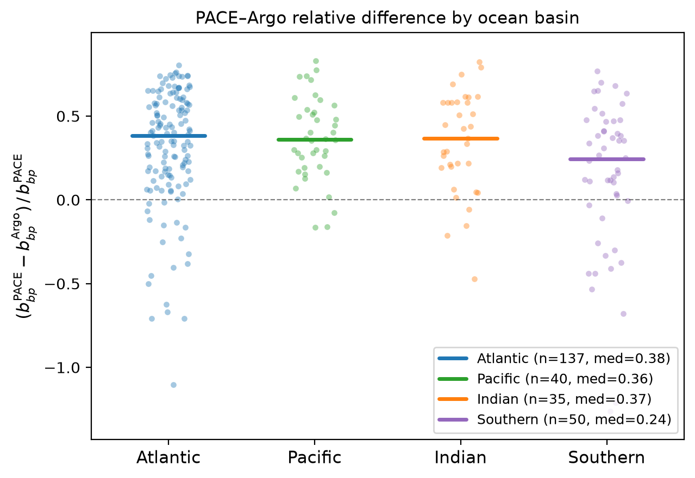

# PACE–Argo bbp700 Analysis Figures

Three figures exploring the systematic positive bias between PACE OCI and
BGC-Argo bbp700 retrievals across 262 valid matchups (March 2024 – May 2026).

Relative difference: `(bbp_bing − bbp_argo) / bbp_bing`

---

## Figure 1 — Relative difference vs. mixed layer depth



The bias shows no clear relationship with mixed layer depth — median relative
difference stays near +0.35 regardless of how deep the mixed layer extends,
suggesting depth mismatch alone does not explain the systematic offset between
PACE and Argo.

**Mixed layer depth** is computed from the Argo density profile using a σ₀
threshold criterion. The Argo bbp700 value is the mean over all measurements
from the surface to MLD (median MLD = 40 m, range 10–557 m). PACE sees the
top ~10–20 m of the water column, so Argo typically averages over a 2–4× deeper
layer — making depth mismatch a plausible candidate for the bias. The flat
quintile medians argue against it being the primary driver.

---

## Figure 2 — Seasonal cycle



The positive bias is consistent across all months (data span March 2024 – May
2026, pooled across years). Monthly medians stay close to the overall median of
+0.35 with no strong seasonal signal, arguing against sun angle, mixed layer
shoaling, or diurnal variability as primary drivers.

---

## Figure 3 — By ocean basin



The positive bias is present in all four ocean basins. The Atlantic dominates
the sample (137 of 262 matchups). Basin-to-basin differences in median bias
may reflect differences in particle type or optical regime rather than
instrument error.

---

## Data

All matchups from `pab.db` via `pab.metrics.compare.gather_matchups()`.
Matchups with NaN Argo bbp700 or |rel_diff| > 1.5 excluded (n = 262 retained).

---

## Code

```python
import sys
import numpy as np
import pandas as pd
import matplotlib.pyplot as plt
from pathlib import Path

sys.path.insert(0, "/path/to/PAB")
from pab.db.store import Store
from pab.metrics.compare import gather_matchups

DB = Path("/path/to/pab.db")
with Store.open(DB, create=False) as store:
    df = gather_matchups(store)
    mld  = store.query_df("SELECT profile_id, mld FROM mld_summary")
    mtch = store.query_df(
        "SELECT matchup_id, profile_id, distance_km, dtime_hours FROM matchups"
    )

df = df.merge(mtch, on="matchup_id", how="left")
df = df.merge(mld, on="profile_id", how="left")
df["rel_diff"] = (df["bbp_bing"] - df["bbp_argo"]) / df["bbp_bing"]
valid = df[
    df["bbp_argo"].notna() &
    df["rel_diff"].notna() &
    df["rel_diff"].between(-1.5, 1.5)
].copy()

# profile observation time for seasonal figure
valid["time_dt"] = pd.to_datetime(valid["time"], utc=True, errors="coerce")
valid["month"]   = valid["time_dt"].dt.month

# basin assignment
def basin(lat, lon):
    if lat <= -35:
        return "Southern"
    if -70 <= lon < 20:
        return "Atlantic"
    if 20 <= lon < 100:
        return "Indian"
    return "Pacific"

valid["basin"] = [basin(r.latitude, r.longitude) for _, r in valid.iterrows()]

# ── Figure 1: rel_diff vs MLD ─────────────────────────────────────────────
mld_valid = valid[valid["mld"].notna() & (valid["mld"] > 0)].copy()
fig1, ax1 = plt.subplots(figsize=(6.5, 4.5))
sc = ax1.scatter(mld_valid["mld"], mld_valid["rel_diff"],
                 c=mld_valid["rel_diff"], cmap="RdBu_r",
                 vmin=-1, vmax=1, alpha=0.6, s=25, linewidths=0)
ax1.axhline(0, color="k", lw=0.8, ls="--", alpha=0.5)
ax1.axhline(mld_valid["rel_diff"].median(), color="firebrick", lw=1.2,
            label=f"median = {mld_valid['rel_diff'].median():.2f}")
bins = np.percentile(mld_valid["mld"], np.linspace(0, 100, 6))
mld_valid["mld_bin"] = pd.cut(mld_valid["mld"], bins=bins)
bmed = mld_valid.groupby("mld_bin", observed=True)["rel_diff"].median()
bmid = [(iv.left + iv.right) / 2 for iv in bmed.index]
ax1.plot(bmid, bmed.values, "k^-", ms=6, lw=1.5,
         label="quintile medians", zorder=5)
fig1.colorbar(sc, ax=ax1, fraction=0.03, pad=0.02, label="Relative difference")
ax1.set_xlabel("Mixed layer depth (m)")
ax1.set_ylabel(r"$(b_{bp}^{\rm PACE} - b_{bp}^{\rm Argo})\,/\,b_{bp}^{\rm PACE}$")
ax1.set_title(f"Relative difference vs. mixed layer depth  (n = {len(mld_valid)})")
ax1.legend(fontsize=9)
ax1.margins(0.04)
fig1.tight_layout()
fig1.savefig("bbp700_reldiff_vs_mld.png", dpi=200, bbox_inches="tight")

# ── Figure 2: seasonal cycle ──────────────────────────────────────────────
MONTHS = ["Jan","Feb","Mar","Apr","May","Jun","Jul","Aug","Sep","Oct","Nov","Dec"]
fig2, ax2 = plt.subplots(figsize=(8, 4.5))
ax2.axhline(0, color="k", lw=0.8, ls="--", alpha=0.5)
ax2.axhline(valid["rel_diff"].median(), color="gray", lw=1, ls=":",
            label=f"overall median = {valid['rel_diff'].median():.2f}")
for m in range(1, 13):
    sub = valid[valid["month"] == m]["rel_diff"]
    if len(sub) == 0:
        continue
    jit = np.random.default_rng(m).uniform(-0.2, 0.2, len(sub))
    ax2.scatter(m + jit, sub.values, s=10, alpha=0.35,
                color="#1f77b4", linewidths=0)
meds = valid.groupby("month")["rel_diff"].median()
ax2.plot(meds.index, meds.values, "o-", color="firebrick",
         ms=7, lw=2, label="monthly median", zorder=5)
ax2.set_xticks(range(1, 13))
ax2.set_xticklabels(MONTHS, fontsize=9)
ax2.set_xlabel("Month (profile observation)")
ax2.set_ylabel(r"$(b_{bp}^{\rm PACE} - b_{bp}^{\rm Argo})\,/\,b_{bp}^{\rm PACE}$")
ax2.set_title(f"Seasonal cycle of PACE–Argo relative difference  (n = {len(valid)})")
ax2.legend(fontsize=9)
ax2.margins(0.04)
fig2.tight_layout()
fig2.savefig("bbp700_reldiff_seasonal.png", dpi=200, bbox_inches="tight")

# ── Figure 3: by ocean basin ──────────────────────────────────────────────
basin_order  = ["Atlantic", "Pacific", "Indian", "Southern"]
basin_colors = {"Atlantic": "#1f77b4", "Pacific": "#2ca02c",
                "Indian": "#ff7f0e", "Southern": "#9467bd"}
fig3, ax3 = plt.subplots(figsize=(6.5, 4.5))
ax3.axhline(0, color="k", lw=0.8, ls="--", alpha=0.5)
for i, bas in enumerate(basin_order):
    sub = valid[valid["basin"] == bas]["rel_diff"]
    if len(sub) == 0:
        continue
    jit = np.random.default_rng(i).uniform(-0.15, 0.15, len(sub))
    ax3.scatter(i + jit, sub.values, s=15, alpha=0.4,
                color=basin_colors[bas], linewidths=0)
    ax3.plot([i - 0.25, i + 0.25], [sub.median(), sub.median()],
             color=basin_colors[bas], lw=2.5, solid_capstyle="round",
             label=f"{bas} (n={len(sub)}, med={sub.median():.2f})")
ax3.set_xticks(range(len(basin_order)))
ax3.set_xticklabels(basin_order, fontsize=11)
ax3.set_ylabel(r"$(b_{bp}^{\rm PACE} - b_{bp}^{\rm Argo})\,/\,b_{bp}^{\rm PACE}$")
ax3.set_title("PACE–Argo relative difference by ocean basin")
ax3.legend(fontsize=9, loc="lower right")
ax3.margins(0.08)
fig3.tight_layout()
fig3.savefig("bbp700_reldiff_by_basin.png", dpi=200, bbox_inches="tight")
```

## How to Reproduce

```bash
conda activate ocean14
cd ~/Documents/summer\ 2026/PAB
python pab/matchup/make_analysis_figures.py
```

