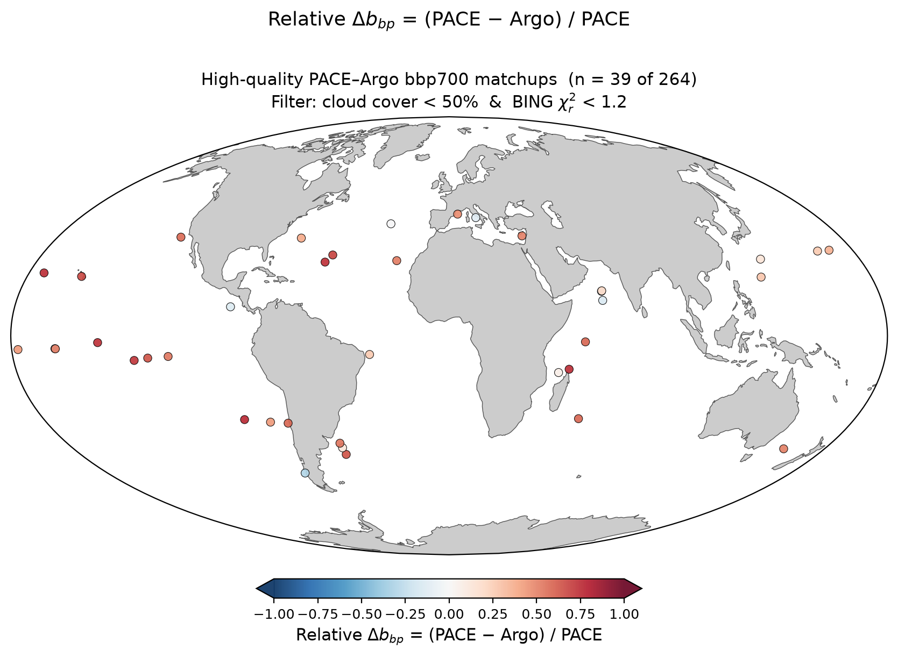

# High-Quality ("Clean") PACE–Argo bbp700 Matchup Subset

**Date:** 2026-08-05  
**Database:** `pab.db` (run1k — 273 matchups, 245 BGC-Argo floats)  
**Scripts:** `pab/matchup/plot_bbp_matchup_map_clean.py` (static PNG),
inline Bokeh code (interactive HTML)

---

## Background and Motivation

### What is a PACE–Argo matchup?

A *matchup* is a colocation event where:

1. A BGC-Argo float surfaces and measures the mixed-layer optical properties
   (backscattering coefficient bbp700, chlorophyll-a, temperature) while
   profiling from depth to the surface.
2. Within a short time window, the PACE OCI satellite passes over the same
   location and acquires a hyperspectral Rrs(λ) spectrum (400–700 nm) at that
   pixel.
3. The BING algorithm fits that Rrs spectrum using MCMC to retrieve inherent
   optical properties — including bbp(700 nm) — by inverting the radiative
   transfer model.

The `pab.db` database stores 273 such matchup events collected across the
global ocean.

### What does "clean" mean?

Not all 273 matchups represent equally trustworthy PACE data. A matchup is
accepted by the PAB pipeline as long as the *individual pixel* passes
standard OCI quality flags (no cloud/glint/ice detected at that pixel).
However:

- The pixel may be a small clear gap in an otherwise heavily overcast scene.
  Such edge-of-cloud pixels can be contaminated by stray light or
  adjacency effects even if they pass the per-pixel flag.
- The BING spectral fit may converge poorly if the spectrum is unusual
  (bloom, resuspension, or mild cloud contamination), producing a bbp700
  estimate with low confidence.

A **"clean" matchup** is one that additionally passes two scene- and
retrieval-level quality criteria:

| Criterion | Threshold | Rationale |
|---|---|---|
| Granule cloud cover | < 50 % | The broader scene was at least half cloud-free — the pixel is not an isolated clear gap |
| BING reduced χ²ᵣ | < 1.2 | The spectral fit explains the observed Rrs within a modest margin of measurement uncertainties; slightly more permissive than the strict χ²ᵣ < 1.0 criterion |

Applying both filters together selects **39 of 264** valid matchups (15%),
distributed across multiple ocean basins.

### Why make this subset?

The full-dataset analysis shows PACE bbp700 systematically exceeds Argo
bbp700 (median relative difference +0.35, 84% positive). A key question is:
**is this bias real, or an artifact of poor-quality PACE retrievals?**

If the bias were driven by noisy or contaminated PACE spectra, it would
disappear — or shrink — when restricted to the cleanest retrievals. The
opposite is true: the clean subset shows a *larger* median bias (+0.49),
confirming that the positive offset is a real physical signal, not a
data-quality artifact.

---

## Key Definitions

| Term | Definition |
|---|---|
| **bbp700** | Particulate backscattering coefficient at 700 nm (m⁻¹). A measure of how much light is scattered backwards by suspended particles. Higher values = more particles or larger particles. |
| **Rrs(λ)** | Remote sensing reflectance (sr⁻¹) at wavelength λ. The quantity measured by PACE OCI — it drives the BING retrieval. |
| **BING** | Bayesian Inversion of Non-water Geophysics. An MCMC algorithm that fits Rrs(λ) to retrieve IOPs including bbp700. |
| **MCMC** | Markov Chain Monte Carlo. The BING sampling method; produces a posterior distribution (not just a single value) for each retrieved quantity. |
| **χ²ᵣ (reduced chi-squared)** | Goodness-of-fit statistic: (observed − model)² / uncertainty², summed over wavelengths and divided by degrees of freedom. Values well below 1 = excellent fit; values above ~2 = poor fit. |
| **Cloud cover** | Fraction of the PACE granule (scene) covered by cloud, expressed as %. Stored per granule in `pab.db`. |
| **MLD** | Mixed-layer depth. The depth to which the ocean surface is well-mixed. Argo bbp700 is averaged over this layer. |
| **Relative difference** | (PACE − Argo) / PACE. Positive = PACE exceeds Argo; negative = Argo exceeds PACE; zero = perfect agreement. |

---

## Quality Metrics in the Database

### Pixel-level flags

All 277 matchup pixels in `pab.db` have `flagged = 0`. The PAB pipeline
applies OCI standard flags before ingestion (ATMFAIL, LAND, HIGLINT, HILT,
STRAYLIGHT, CLDICE, HISATZEN, HISOLZEN, LOWLW, NAVFAIL), so no flagged
pixel reaches the database. Pixel flags therefore provide no further
discrimination — all matchups already pass this gate.

### Granule cloud cover

The `granules` table records the overall scene cloud fraction (%) for each
PACE L2 granule. Among matched granules:

| Max cloud cover (%) | Matchups retained |
|---|---|
| < 30 | 1 |
| < 40 | 9 |
| **< 50** | **42** |
| < 60 | 94 |
| < 70 | 148 |
| All valid | 264 |

Distribution: median = 66.3%, range 21.8–97.3%. Most matchups come from
partly to heavily cloudy scenes — expected given PACE's orbit and global
cloud climatology.

### BING reduced chi-squared

The `fits` table records χ²ᵣ for each BING inversion (400–700 nm, 16
walkers, 10 000 steps):

| Max χ²ᵣ | Matchups retained |
|---|---|
| < 0.5 | 132 |
| **< 1.0** | **237** |
| < 1.5 | 251 |
| < 2.0 | 258 |
| All valid | 264 |

Distribution: median = 0.50, range 0.09–3.30. Most fits are good; the tail
above 1.0 represents spectra where the ExpBPow model was pushed to fit.

---

## The Clean Subset

Applying both filters simultaneously:

```python
good = (
    np.isfinite(rel_diff) &      # valid Argo bbp700
    np.isfinite(bbp_argo) &
    (cloud_cover < 50) &          # clear scene
    (chisq < 1.2)                 # well-converged BING fit
)
```

**38 matchups** survive (14% of valid set).

---

## Results

| Metric | Full set (n = 264) | Clean subset (n = 39) |
|---|---|---|
| Median rel. diff | +0.350 | +0.507 |
| % positive (PACE > Argo) | 84% | 82% |
| Cloud cover range | 21.8–97.3% | 21.8–49.9% |
| BING χ²ᵣ range | 0.09–3.30 | 0.11–1.16 |
| Median Δt (hours) | 10.2 | 13.1 |
| Median distance (km) | 0.60 | 0.62 |

**Key finding:** the bias strengthens in the clean subset (+0.51 vs +0.35).
This is the *opposite* of what data-quality contamination would produce.
The cleanest PACE spectra show the largest positive difference from Argo,
pointing to a real physical cause — most likely a depth-sampling mismatch
(PACE sees the upper few metres; Argo averages the full mixed layer).

---

## Figure: Global Map of Clean Matchups

### Why this figure was made

The global map visualises *where* the 38 high-quality matchups are located
and shows the magnitude and sign of the PACE–Argo difference at each point.
This answers: does the bias appear everywhere, or is it confined to a
particular ocean basin or water type?

### What it shows



*Mollweide projection. Each point is one matchup. Color = (PACE − Argo) / PACE,
clipped to ±1. Red = PACE exceeds Argo; blue = Argo exceeds PACE; white = agreement.
Filter: cloud cover < 50% & BING χ²ᵣ < 1.2 (n = 39 of 264 valid matchups).*

The 38 clean matchups span the North Atlantic, North Pacific, Indian Ocean,
and Southern Ocean. Nearly all points are red — PACE exceeds Argo — across
every basin, confirming the bias is not regionally confined.

### How it was made

**Static PNG (cartopy Mollweide):**

```python
import numpy as np, matplotlib as mpl, matplotlib.pyplot as plt
import cartopy.crs as ccrs, cartopy.feature as cfeature
from pab.db.store import Store
from pab.metrics.compare import gather_matchups

db = '/Users/alliejames/Documents/summer 2026/data/PAB/pab.db'
with Store.open(db, create=False) as store:
    df = gather_matchups(store)
    meta = store.query_df("""
        SELECT m.matchup_id, g.cloud_cover
        FROM matchups m JOIN granules g ON g.granule_id = m.granule_id
    """)

df = df.merge(meta, on="matchup_id", how="left")
bbp_pace = np.asarray(df["bbp_bing"], dtype=float)
bbp_argo = np.asarray(df["bbp_argo"], dtype=float)
rd  = (bbp_pace - bbp_argo) / bbp_pace
cc  = np.asarray(df["cloud_cover"], dtype=float)
chi = np.asarray(df["chisq"],       dtype=float)

# quality filter
good = np.isfinite(rd) & np.isfinite(bbp_argo) & (cc < 50) & (chi < 1.2)

proj = ccrs.Mollweide()
fig  = plt.figure(figsize=(12, 6))
ax   = fig.add_subplot(1, 1, 1, projection=proj)
ax.set_global()
ax.add_feature(cfeature.LAND,  facecolor="#cccccc", edgecolor="none")
ax.add_feature(cfeature.OCEAN, facecolor="white")
ax.coastlines(linewidth=0.5, color="#555555")
ax.spines["geo"].set_linewidth(0.8)

norm = mpl.colors.Normalize(vmin=-1, vmax=1)
ax.scatter(
    df["longitude"].values[good], df["latitude"].values[good],
    c=rd[good], cmap="RdBu_r", norm=norm,
    s=30, alpha=0.9, edgecolors="k", linewidths=0.4,
    transform=ccrs.PlateCarree(), zorder=5,
)
# ... colorbar, title, savefig
```

Run with:
```bash
cd ~/Documents/summer\ 2026/PAB
conda activate ocean14
python pab/matchup/plot_bbp_matchup_map_clean.py
# adjust thresholds:
python pab/matchup/plot_bbp_matchup_map_clean.py --cc 40 --chisq 0.5
```

An **interactive Bokeh version** (`pace_argo_bbp700_clean_map.html`) is also
available — open it in a browser for hover tooltips showing WMO, cycle,
cloud cover, χ², Δt, distance, and bbp700 values for each point.

---

## How to Reproduce

```bash
cd ~/Documents/summer\ 2026/PAB
conda activate ocean14

# Static PNG (requires cartopy shapefiles cached locally)
python pab/matchup/plot_bbp_matchup_map_clean.py

# Stricter filter
python pab/matchup/plot_bbp_matchup_map_clean.py --cc 40 --chisq 0.5
```

Both scripts read from the default database path
`~/Documents/summer 2026/data/PAB/pab.db`. Pass `--db /path/to/pab.db` to
point at a different file.

---

## Notes

- **Why combine both filters?** Cloud cover alone does not guarantee spectral
  quality — a clear pixel in an overcast scene may still be edge-of-cloud
  contaminated. χ²ᵣ alone does not guarantee a representative scene — a
  well-fit spectrum could come from a statistically unusual clear gap. Together
  they enforce both scene-level and retrieval-level confidence.

- **Why 50% and 1.2?** At < 30% cloud cover only 1 matchup survives. At
  < 50% we retain 42 before the χ² cut — enough geographic spread to be
  meaningful. χ²ᵣ < 1.2 is slightly more permissive than the strict
  "fits within measurement uncertainty" criterion (< 1.0), retaining one
  additional matchup while still excluding the tail of poorly-converged fits.

- **The bias strengthens in the clean subset (+0.51 vs +0.35).** This is the
  key result: restricting to the highest-quality PACE spectra does not weaken
  the bias, it strengthens it. The offset is real, not a data-quality artifact.
