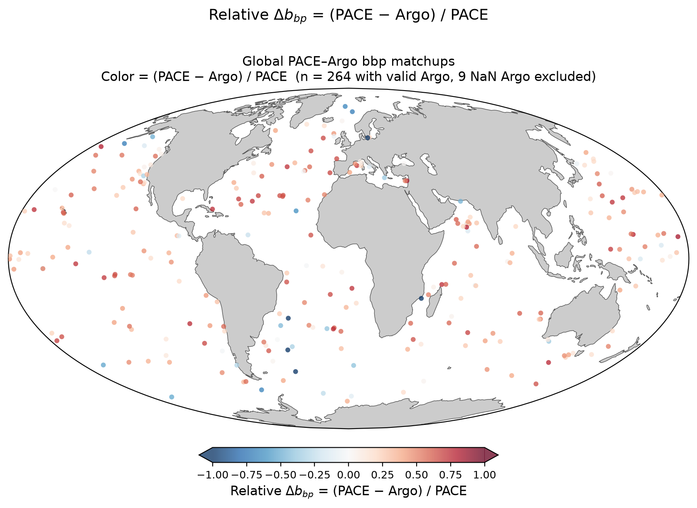

# Global PACE – Argo bbp700 Matchup Maps

**Date:** 2026-08-03  
**Database:** `pab.db` (run1k — 273 matchups, 245 floats, 652 unique WMOs)  
**Scripts:**  
- `pab/matchup/plot_bbp_matchup_map_global.py` — static Mollweide PNG (cartopy)  
- `pab/matchup/plot_bbp_matchup_map_bokeh_global.py` — interactive HTML (Bokeh)

---

## Figures

### Static map (cartopy)


*Mollweide projection. Color = (PACE − Argo) / PACE, clipped to ±1. Red = PACE exceeds Argo. Blue = Argo exceeds PACE.*

### Interactive map (Bokeh)
Open `pace_argo_bbp700_global_map.html` in a browser.  
Hover over any point to see float WMO, cycle, position, PACE and Argo bbp700 values, relative difference, Δt, and distance.

---

## What the figures show

Both maps plot the same quantity — the relative difference between PACE OCI bbp(700 nm)
retrieved via the BING spectral inversion and the BGC-Argo mixed-layer bbp(700 nm) —
at every satellite–float matchup in the database.

**Color convention:** red = PACE exceeds Argo, blue = Argo exceeds PACE, white = agreement.
Color scale is clipped at ±1. Points with no valid Argo bbp700 (NaN) are excluded.

**Key result:** 222 of 264 valid matchups (84%) are positive — PACE systematically
exceeds Argo bbp700 by a median of +0.35. The bias is global and appears across
all ocean basins, suggesting a systematic rather than regional cause. Leading
hypothesis: depth mismatch — PACE integrates over ~1 optical depth (~few metres),
while Argo averages over the full mixed layer (typically 20–60 m); if bbp700
decreases with depth within the mixed layer, PACE will exceed the MLD mean.

---

## Data

Matchups are drawn from `pab.db` by joining five tables:

| Table | Role |
|---|---|
| `matchups` | Links a profile to a PACE granule (distance, Δt) |
| `profiles` | Float WMO, cycle, position, time |
| `mld_summary` | Argo mixed-layer bbp700, Chl-a, temperature |
| `fits` | BING MCMC fit metadata for each matchup |
| `fit_results` | Posterior median and 90% CI for each retrieved quantity |

The join is performed by `pab.metrics.compare.gather_matchups(store)`.

**Relative difference formula:**
```
rel_diff = (bbp700_PACE − bbp700_Argo) / bbp700_PACE
```

Points with `bbp_argo = NaN` (9 of 273 matchups) are excluded from both maps.
Points where `|rel_diff| > 1` are retained in the data but clipped to ±1 on the
color scale.

---

## How the static map was made (`plot_bbp_matchup_map_global.py`)

```python
import cartopy.crs as ccrs
import cartopy.feature as cfeature

proj = ccrs.Mollweide()
fig  = plt.figure(figsize=(12, 6))
ax   = fig.add_subplot(1, 1, 1, projection=proj)

ax.set_global()
ax.add_feature(cfeature.LAND,  facecolor="#cccccc", edgecolor="none")
ax.add_feature(cfeature.OCEAN, facecolor="white")
ax.coastlines(linewidth=0.5, color="#555555")
ax.spines["geo"].set_linewidth(0.8)

sc = ax.scatter(
    lon, lat,
    c=rel_diff,
    cmap="RdBu_r", norm=mpl.colors.Normalize(vmin=-1, vmax=1),
    s=18, alpha=0.75,
    transform=ccrs.PlateCarree(),
)

cbar = fig.colorbar(sc, orientation="horizontal",
                    fraction=0.04, pad=0.05, shrink=0.7, extend="both")
cbar.set_label(r"Relative $\Delta b_{bp}$ = (PACE $-$ Argo) / PACE")
```

Key choices:
- **Mollweide** projection preserves area — useful for showing global distribution without polar distortion
- **`ccrs.PlateCarree()`** transform on `scatter` — data are in lat/lon degrees, must be reprojected
- **`extend="both"`** on colorbar — signals that values outside ±1 exist but are clipped
- Requires cartopy's Natural Earth shapefiles cached at `~/.local/share/cartopy/`

---

## How the interactive map was made (`plot_bbp_matchup_map_bokeh_global.py`)

```python
from bokeh.plotting import figure
from bokeh.models import WMTSTileSource, LinearColorMapper, ColorBar, HoverTool
from bokeh.palettes import RdBu11

# Convert lat/lon to Web Mercator (required for tile basemap)
x = lon * 20037508.34 / 180.0
y = log(tan(pi/4 + radians(lat)/2)) * 20037508.34 / pi

# CartoDB light basemap (no API key)
tile = WMTSTileSource(
    url="https://cartodb-basemaps-a.global.ssl.fastly.net/light_all/{Z}/{X}/{Y}.png"
)

# RdBu11: palette[0]=dark-blue (low), palette[-1]=dark-red (high)
mapper = LinearColorMapper(palette=RdBu11, low=-1.0, high=1.0)

p = figure(x_axis_type="mercator", y_axis_type="mercator")
p.add_tile(tile)
p.scatter("x", "y", source=source,
          color=transform("rel_diff", mapper), size=8, alpha=0.8)

# Hover tool shows matchup details per point
hover = HoverTool(tooltips=[
    ("Float / Cycle", "@wmo  c@cycle"),
    ("Rel. diff",     "@rd_raw{+0.3f}"),
    ("PACE bbp700",   "@bbp_pace{0.3f} ×10⁻⁴ m⁻¹"),
    ("Argo bbp700",   "@bbp_argo{0.3f} ×10⁻⁴ m⁻¹"),
    ("Δt",            "@dtime_h h"),
    ("Distance",      "@dist_km km"),
])
```

Key choices:
- **Web Mercator** coordinates required by the tile basemap (WMTSTileSource)
- **CartoDB Positron** tile — light grey land, white ocean, no API key needed, requires internet
- **`RdBu11` (not reversed)** — Bokeh's `LinearColorMapper` maps `low` → `palette[0]` (dark blue) and `high` → `palette[-1]` (dark red), matching the `RdBu_r` convention
- **Hover tool** — shows all matchup metadata per point, interactive in browser

---

## How to reproduce

```bash
cd ~/Documents/summer\ 2026/PAB
conda activate ocean14

# Static PNG
python pab/matchup/plot_bbp_matchup_map_global.py

# Interactive HTML
python pab/matchup/plot_bbp_matchup_map_bokeh_global.py
```

Both scripts accept `--db` and `--out` arguments to point at a different database or save location.

---

## Data summary

| Quantity | Value |
|---|---|
| Total matchups | 273 |
| Valid Argo bbp700 | 264 |
| Positive rel_diff (PACE > Argo) | 222 (84%) |
| Negative rel_diff (Argo > PACE) | 42 (16%) |
| Median rel_diff | +0.35 |
| Mean rel_diff (clipped ±1) | +0.28 |

---

## Notes

- Extreme outliers (e.g. WMO 4903784, rel_diff = −15.7; WMO 6990505, rel_diff = −7.0) indicate
  possible Argo sensor issues or unusual bloom events — both are shown at the colorbar floor (−1.0)
  on the maps.
- The Bokeh map requires an internet connection to load the CartoDB tile layer.
  All matchup data is embedded locally in the HTML file.
- The static PNG is fully self-contained and suitable for publication or reports.
