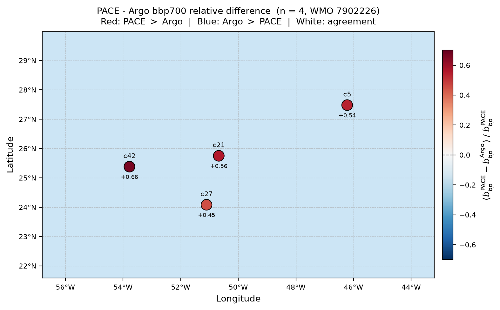

# PACE – Argo bbp700 Relative Difference Map

**Date:** 2026-07-28  
**Float:** WMO 7902226  
**Matchups:** n = 4  
**Script:** `pab/pace/plot_bbp_matchup_map.py`

---

## Figure



*Each dot is one PACE–Argo matchup. Color encodes the relative difference
(PACE − Argo) / PACE: red = PACE exceeds Argo, blue = Argo exceeds PACE,
white = agreement. Cycle number (c5, c21, c27, c42) is labeled above each dot;
the ± value below is the per-point relative difference.*

---

## What the figure shows

PACE OCI retrieves particulate backscattering at 700 nm (bbp700) through the
BING spectral inversion algorithm. BGC-Argo float 7902226 measures bbp700
directly with a WET Labs ECO sensor. This figure compares the two estimates
at every satellite–float matchup, showing how PACE bbp700 differs from the
in-situ Argo value as a fraction of the PACE value.

All four current matchups are positive (red), meaning **PACE consistently
exceeds the float mixed-layer mean bbp700 by 45–66 %**.

---

## Data sources

| Source | Variable | Location in `pab.db` |
|---|---|---|
| PACE OCI L2 AOP (V3.1/V3.2) | bbp700 posterior median | `fit_results.value` where `quantity = 'BING_ExpBPow_bbp700'` |
| BGC-Argo float 7902226 | bbp700 MLD mean (de-spiked) | `mld_summary.bbp700` |
| Float positions | latitude, longitude | `profiles.latitude / longitude` |

PACE bbp700 is the posterior median from the BING ExpBPow MCMC fit
(10 000 steps, 1 000 burn-in, 16 walkers, 400–700 nm fit window).
Argo bbp700 is the de-spiked mean within the mixed-layer depth
(de Boyer Montégut 0.03 kg m⁻³ density criterion).

---

## Matchup values

| Cycle | Lat (°N) | Lon (°W) | PACE bbp700 (m⁻¹) | Argo bbp700 (m⁻¹) | Rel. diff | Δt (h) | Dist (km) |
|------:|---------:|---------:|------------------:|------------------:|----------:|-------:|----------:|
| 5     | 27.479   | 46.221   | 0.000922          | 0.000427          | +0.54     | 19.6   | 0.45      |
| 21    | 25.751   | 50.678   | 0.000738          | 0.000323          | +0.56     | 13.4   | 0.32      |
| 27    | 24.082   | 51.103   | 0.000929          | 0.000509          | +0.45     | 3.1    | 0.29      |
| 42    | 25.381   | 53.777   | 0.001001          | 0.000335          | +0.66     | 0.7    | 0.58      |

Relative difference = (bbp700_PACE − bbp700_Argo) / bbp700_PACE.

---

## Method

### 1. Gather matchups

`pab.metrics.compare.gather_matchups(store)` joins the `matchups`,
`profiles`, `mld_summary`, `fits`, and `fit_results` tables in a single
SQL query, returning one row per matchup with both the PACE and Argo
bbp700 values aligned.

### 2. Compute relative difference

```python
rel_diff = (bbp_pace - bbp_argo) / bbp_pace
```

### 3. Map extent

The map is auto-padded around the data extent (40 % of the lon/lat range,
minimum 2.5°), so it resizes automatically as more matchups accumulate.

### 4. Color scale

Diverging `RdBu_r` colormap, symmetric around zero. The color limits are
set to ± the maximum observed |rel_diff| rounded up to the nearest 0.1,
keeping the zero-agreement white point at the true center.

### 5. Annotations

Each dot is labeled with its Argo cycle number (above) and ± relative
difference value (below). A dashed zero-line is drawn on the colorbar.

---

## How to reproduce

```bash
python pab/pace/plot_bbp_matchup_map.py \
    --db /path/to/pab.db \
    --out pace_argo_bbp700_relDiff_map.png \
    --dpi 200
```

Or from Python:

```python
from pab.db.store import Store
from pab.metrics.compare import gather_matchups
from pab.pace.plot_bbp_matchup_map import plot_bbp_matchup_map

with Store.open("pab.db", create=False) as store:
    df = gather_matchups(store)

fig = plot_bbp_matchup_map(df)
fig.savefig("pace_argo_bbp700_relDiff_map.png", dpi=200, bbox_inches="tight")
```

---

## Full script (`pab/pace/plot_bbp_matchup_map.py`)

```python
"""One-off script: regional map of PACE-Argo bbp700 matchups coloured by
relative backscattering difference (PACE - Argo) / PACE.

Positive (red): PACE bbp700 > Argo bbp700
Negative (blue): Argo bbp700 > PACE bbp700
White: perfect agreement

Usage
-----
    python pab/pace/plot_bbp_matchup_map.py \
        --db /path/to/pab.db \
        --out pace_argo_bbp700_relDiff_map.png
"""

from __future__ import annotations

import argparse
import sys
from pathlib import Path

import matplotlib.pyplot as plt
import matplotlib.ticker as mticker
import numpy as np

PAB_DB_DEFAULT = Path("/Users/alliejames/Documents/summer 2026/data/PAB/pab.db")


def _parse_args(argv=None):
    p = argparse.ArgumentParser(description=__doc__)
    p.add_argument("--db", type=Path, default=PAB_DB_DEFAULT)
    p.add_argument("--out", type=Path, default=Path("pace_argo_bbp700_relDiff_map.png"))
    p.add_argument("--dpi", type=int, default=200)
    return p.parse_args(argv)


def plot_bbp_matchup_map(df, *, outfile=None, dpi: int = 200):
    bbp_pace = np.asarray(df["bbp_bing"], dtype=float)
    bbp_argo = np.asarray(df["bbp_argo"], dtype=float)
    rel_diff = (bbp_pace - bbp_argo) / bbp_pace

    lon = np.asarray(df["longitude"], dtype=float)
    lat = np.asarray(df["latitude"], dtype=float)

    abs_max = np.nanmax(np.abs(rel_diff))
    vmax = max(np.ceil(abs_max * 10) / 10, 0.1)
    vmin = -vmax

    lon_pad = max((lon.max() - lon.min()) * 0.4, 2.5)
    lat_pad = max((lat.max() - lat.min()) * 0.4, 2.5)
    x0, x1 = lon.min() - lon_pad, lon.max() + lon_pad
    y0, y1 = lat.min() - lat_pad, lat.max() + lat_pad

    fig, ax = plt.subplots(figsize=(8, 5))
    ax.set_xlim(x0, x1)
    ax.set_ylim(y0, y1)
    ax.set_facecolor("#cce5f5")
    ax.xaxis.set_major_formatter(mticker.FuncFormatter(
        lambda v, _: f"{abs(v):.0f}\u00b0{'W' if v < 0 else 'E'}"))
    ax.yaxis.set_major_formatter(mticker.FuncFormatter(
        lambda v, _: f"{abs(v):.0f}\u00b0{'S' if v < 0 else 'N'}"))
    ax.grid(linewidth=0.5, color="#aaaaaa", alpha=0.6, linestyle="--")
    ax.tick_params(labelsize=8)

    sc = ax.scatter(lon, lat, c=rel_diff, cmap="RdBu_r",
                    vmin=vmin, vmax=vmax, s=150,
                    edgecolors="k", linewidths=0.8, zorder=5)

    if "cycle" in df.columns:
        for _, row in df.iterrows():
            ax.annotate(f"c{int(row['cycle'])}", xy=(row["longitude"], row["latitude"]),
                        fontsize=7.5, color="#111111", ha="center", va="bottom",
                        xytext=(0, 8), textcoords="offset points", zorder=6)

    for i in range(len(df)):
        ax.annotate(f"{rel_diff[i]:+.2f}", xy=(lon[i], lat[i]),
                    fontsize=6.5, color="#111111", ha="center", va="top",
                    xytext=(0, -9), textcoords="offset points", zorder=6)

    cbar = fig.colorbar(sc, ax=ax, orientation="vertical",
                        fraction=0.03, pad=0.02, shrink=0.85)
    cbar.set_label(
        r"$(b_{bp}^{\rm PACE} - b_{bp}^{\rm Argo})\;/\;b_{bp}^{\rm PACE}$",
        fontsize=10)
    cbar.ax.axhline(0, color="k", lw=0.8, ls="--")
    cbar.ax.tick_params(labelsize=8)

    n = len(df)
    wmo_list = (", ".join(str(w) for w in sorted(df["wmo"].unique()))
                if "wmo" in df.columns else "?")
    ax.set_title(
        f"PACE - Argo bbp700 relative difference  (n = {n}, WMO {wmo_list})\n"
        r"Red: PACE $>$ Argo  |  Blue: Argo $>$ PACE  |  White: agreement",
        fontsize=10, pad=8)
    ax.set_xlabel("Longitude")
    ax.set_ylabel("Latitude")
    fig.tight_layout()

    if outfile is not None:
        outfile = Path(outfile)
        fig.savefig(outfile, dpi=dpi, bbox_inches="tight")
        plt.close(fig)
        return outfile
    return fig


def main(argv=None):
    args = _parse_args(argv)
    if not args.db.exists():
        sys.exit(f"ERROR: pab.db not found at {args.db}.")
    from pab.db.store import Store
    from pab.metrics.compare import gather_matchups
    with Store.open(args.db, create=False) as store:
        df = gather_matchups(store)
    if df.empty:
        sys.exit("No matchups with BING fits found.")
    plot_bbp_matchup_map(df, outfile=args.out, dpi=args.dpi)


if __name__ == "__main__":
    main()
```

---

## Notes and caveats

- **PACE bbp700** is the BING posterior **median**; the 90 % credible
  interval spans roughly ±15–20 % of the median value across these 4
  matchups, so retrieval uncertainty alone does not explain the systematic
  offset.
- **Argo bbp700** is the de-spiked mixed-layer mean (de Boyer Montégut
  0.03 kg m⁻³ criterion). Mixed-layer depths at these matchups range from
  18 to 36 m; values below the MLD are excluded.
- **Depth mismatch:** PACE sees a surface optical depth (typically a few
  metres in oligotrophic water), whereas the Argo value averages over the
  full mixed layer. If bbp700 decreases with depth within the mixed layer,
  PACE would be expected to exceed the mixed-layer mean — this is a
  plausible contributor to the positive bias.
- **Temporal separation:** cycles 5 (Δt = 19.6 h) and 21 (Δt = 13.4 h)
  have substantial time gaps; diurnal variability in backscattering could
  contribute for those matchups. Cycle 42 (Δt = 0.7 h) has the tightest
  timing and still shows the largest offset (+0.67), suggesting the bias
  is not solely temporal.
- **n = 4:** all conclusions are preliminary. More matchups are needed
  before drawing quantitative conclusions about bias magnitude.

---

## References

- Loisel, H. & Stramski, D. (2000). Estimation of the inherent optical
  properties of natural waters from the irradiance attenuation coefficient
  and reflectance in the presence of Raman scattering. *Applied Optics*,
  39(18), 3001–3011.
- de Boyer Montégut, C. et al. (2004). Mixed layer depth over the global
  ocean: An examination of profile data and a profile-based climatology.
  *Journal of Geophysical Research: Oceans*, 109(C12).
- Bailey, S. W. & Werdell, P. J. (2006). A multi-sensor approach for the
  on-orbit validation of ocean color satellite data products. *Remote
  Sensing of Environment*, 102(1–2), 12–23.
