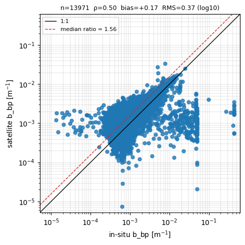
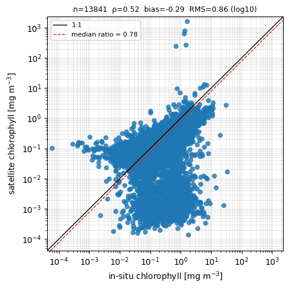
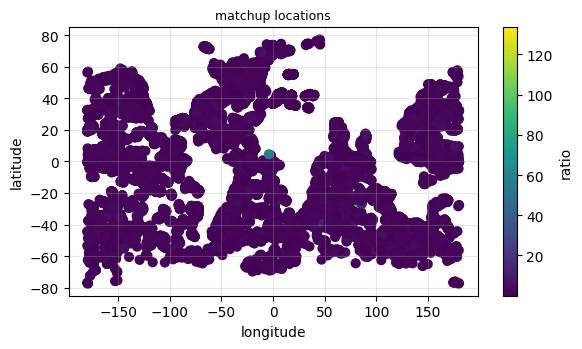

Satellite vs float comparisons
==============================

14,609 matchups — shown as static summary figures (the interactive per-point scatter is suppressed at this scale to keep the committed site small; per-matchup values are in the downloadable summary table on the :doc:`Downloads <downloads>` page).

   Satellite vs float ``b_bp`` (700 nm), log-log.

   Satellite vs float chlorophyll, log-log.

   Matchup locations, coloured by sat/float ``b_bp`` ratio.
