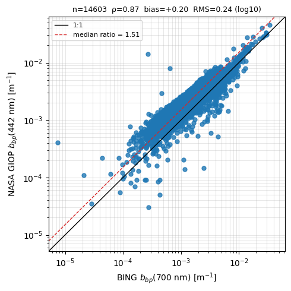

Satellite vs float comparisons
==============================

14,609 matchups — shown as static summary figures (the interactive per-point scatter is suppressed at this scale to keep the committed site small; per-matchup values are in the downloadable summary table on the :doc:`Downloads <downloads>` page).

.. figure:: _static/comparisons/bbp_scatter.png
   :width: 520px

   Satellite vs float ``b_bp`` (700 nm), log-log.

.. figure:: _static/comparisons/chl_scatter.png
   :width: 520px

   Satellite vs float chlorophyll, log-log.

.. figure:: _static/comparisons/matchup_map.png
   :width: 520px

   Matchup locations, coloured by sat/float ``b_bp`` ratio.

BING vs NASA GIOP (L2 IOP)
--------------------------

The same PACE overpasses, retrieved two ways: **BING** (this project) against NASA's own **GIOP** retrieval, read from the operational ``PACE_OCI_L2_IOP`` product at the *same pixel* used for the BING fit. See the :doc:`Methods <methods>` page for the product details and provenance.

**Wavelength caveat:** NASA reports ``b_bp`` at **442 nm** while BING's headline ``b_bp`` is at **700 nm** (chosen to match the float ``BBP700``). The two are compared **as-is, with no spectral adjustment**, so a ratio above 1 is expected simply from the blue-to-red decrease of particulate backscatter — read the scatter as a *consistency* check, not a like-for-like validation.

- n = 14603; median NASA(442)/BING(700) ratio = 1.51 (IQR 1.33–2.02); Spearman ρ = 0.866; log10 offset = 0.202, RMS = 0.239.

   NASA GIOP ``b_bp`` (442 nm) vs BING ``b_bp`` (700 nm), log-log — **note the differing wavelengths** (no spectral adjustment applied).
