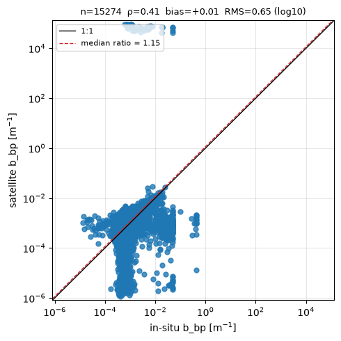
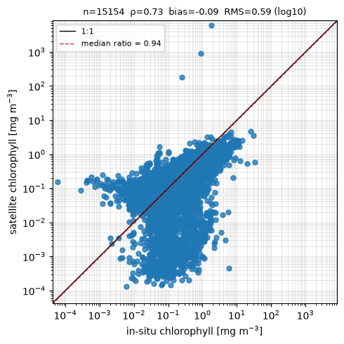
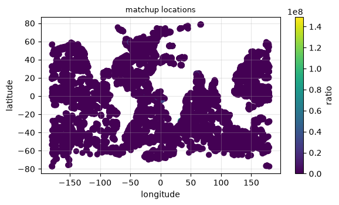
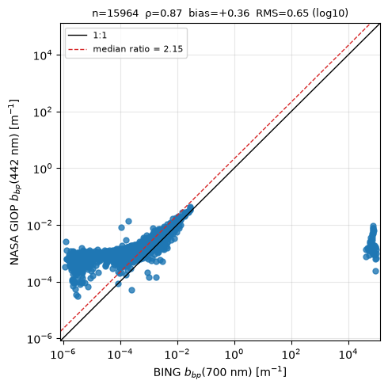
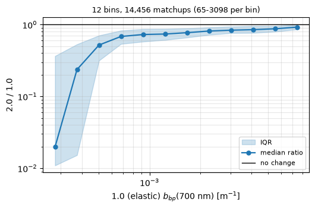
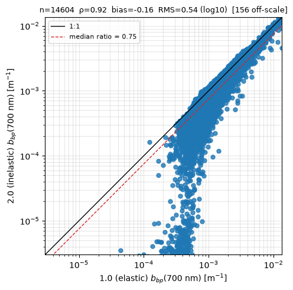
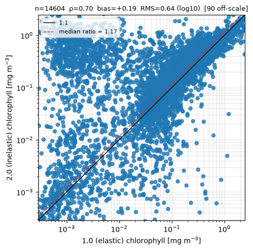
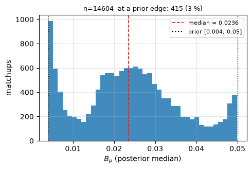

Satellite vs float comparisons
==============================

15,971 matchups — shown as static summary figures (the interactive per-point scatter is suppressed at this scale to keep the committed site small; per-matchup values are in the downloadable summary table on the :doc:`Downloads <downloads>` page).

   Satellite vs float ``b_bp`` (700 nm), log-log.

   Satellite vs float chlorophyll, log-log.

   Matchup locations, coloured by sat/float ``b_bp`` ratio.

BING vs NASA GIOP (L2 IOP)
--------------------------

The same PACE overpasses, retrieved two ways: **BING** (this project) against NASA's own **GIOP** retrieval, read from the operational ``PACE_OCI_L2_IOP`` product at the *same pixel* used for the BING fit. See the :doc:`Methods <methods>` page for the product details and provenance.

**Wavelength caveat:** NASA reports ``b_bp`` at **442 nm** while BING's headline ``b_bp`` is at **700 nm** (chosen to match the float ``BBP700``). The two are compared **as-is, with no spectral adjustment**, so a ratio above 1 is expected simply from the blue-to-red decrease of particulate backscatter — read the scatter as a *consistency* check, not a like-for-like validation.

- n = 15964; median NASA(442)/BING(700) ratio = 2.15 (IQR 1.68–2.89); Spearman ρ = 0.874; log10 offset = 0.359, RMS = 0.648.

   NASA GIOP ``b_bp`` (442 nm) vs BING ``b_bp`` (700 nm), log-log — **note the differing wavelengths** (no spectral adjustment applied).

1.0 vs 2.0 — elastic vs inelastic retrieval
-------------------------------------------

The **same 14,604 matchups**, fitted twice: the 1.0 results come from the frozen v1 release, the 2.0 results from this one. Rows are paired on matchup **and pixel**, so a difference below is a difference in the retrieval, not in which patch of ocean was looked at. See the :doc:`Methods <methods>` page for the two-database provenance.

**What changed in 2.0.** The 1.0 fits used the *elastic* Gordon radiative-transfer model: ``Rrs`` is produced by absorption and elastic scattering alone. 2.0 re-fits the same spectra with an **inelastic** forward model:

- **Radiative-transfer backend** — ``robust_hybrid`` (a neural-network emulator of a full RT solution) replaces the analytic ``gordon`` parameterisation.
- **Raman scattering** — water molecules re-emit absorbed blue light at longer wavelengths; included.
- **Chlorophyll fluorescence** — the ~685 nm phytoplankton emission line, at quantum yield ``phi_C = 0.02``; included.
- **CDOM fluorescence** — available in the model but **off** in this run, so none of the results below include it.
- **Free ``B_p``** — the backscatter phase-function parameter, held fixed in 1.0, is a sixth fitted parameter in 2.0 with a uniform prior over ``[0.004, 0.05]``.

The **fit window is unchanged** at 400–700 nm. The red edge (713/719 nm, where Raman and fluorescence are strongest) was evaluated and deliberately left out: on a 97-matchup diagnostic sample Rrs(719) is negative or noise-dominated on **44 %** of matchups, so including it would feed the inelastic terms mostly noise.

- **b_bp(700 nm)** — n = 14,604; median 2.0/1.0 ratio = 0.75 (IQR 0.612–0.877); Spearman ρ = 0.924; log10 offset = -0.157, RMS = 0.536.

- **chlorophyll** — n = 14,604; median 2.0/1.0 ratio = 1.17 (IQR 1.01–1.42); Spearman ρ = 0.704; log10 offset = 0.191, RMS = 0.644.

Result: the inelastic correction is a clear-water effect
~~~~~~~~~~~~~~~~~~~~~~~~~~~~~~~~~~~~~~~~~~~~~~~~~~~~~~~~

The single median ratio understates and overstates by turns, because the shift is a strong, monotonic function of how much backscatter there is to begin with. Split by the 1.0 ``b_bp`` into terciles, the median 2.0/1.0 ratio runs clearest third 0.66; middle third 0.74; most-scattering third 0.81 (tercile edges 0.000975 and 0.00156 m⁻¹), and it keeps going at the extremes: below 2e-4 m⁻¹ the ratio is ~0.02, i.e. 2.0 retrieves some **fifty times less** backscatter than 1.0.

This is the expected behaviour of the physics, not an artifact. Raman scattering and chlorophyll fluorescence contribute a roughly fixed radiance; what varies is how much *elastic* signal sits underneath them. In clear water the elastic contribution is small, so the inelastic terms are a large fraction of ``Rrs`` — and the 1.0 model, which has no inelastic terms at all, could only explain that radiance by inventing particulate backscatter. 2.0 attributes it to the processes that actually produce it, and the retrieved ``b_bp`` drops accordingly. In productive water the elastic signal dominates, the inelastic terms are a small correction, and the two versions converge — the most-scattering tercile differs by only 19 %.

The practical consequence: the headline ratio is a population median and **not** a correction factor to apply to a single retrieval. Which end of this curve a matchup sits on matters more than the median does.

   The 2.0/1.0 ``b_bp`` ratio against the 1.0 value, with the interquartile band. The curve rises from ~0.02 in the clearest water to ~0.95 in the most scattering: the inelastic correction is large where the elastic signal is weak and vanishes where it is strong. Bins with fewer than 20 matchups are not plotted.

**Retrieval failures.** 48 of 14,604 2.0 fits (0.33 %) return ``b_bp(700 nm)`` above 1 m⁻¹, which is not a possible value for seawater (the open ocean spans roughly 1e-4 to 1e-1 m⁻¹); the largest is 9.32e+04 m⁻¹. The same matchups fitted in 1.0 produce 0 such values (maximum 0.0337 m⁻¹), so these are specific to the 2.0 configuration. They are **left in** every statistic on this page — the medians and Spearman ρ are rank-based and barely move — and are flagged here rather than filtered, so the failure rate stays visible.

**They are not scattered at random — they are the clear-water tail.** The failures spread over many granules, carry every convergence flag set, and have viewing geometry, separation and spectrum count indistinguishable from the rest; what separates them is the regime. Rate by retrieved chlorophyll:

.. list-table::
   :header-rows: 1

   * - Chl [mg m⁻³]
     - matchups
     - non-physical
     - rate
   * - < 0.01
     - 700
     - 22
     - 3.14 %
   * - 0.01–0.02
     - 189
     - 20
     - 10.58 %
   * - 0.02–0.05
     - 632
     - 3
     - 0.47 %
   * - 0.05–0.1
     - 2,145
     - 0
     - 0.00 %
   * - 0.1–0.3
     - 6,729
     - 0
     - 0.00 %
   * - > 0.3
     - 4,209
     - 3
     - 0.07 %

So the same mechanism that makes the inelastic correction large in clear water also makes the retrieval ill-conditioned there, and in a small number of cases it fails outright. **No single-variable filter isolates them**: a χ² cut that catches most of them flags fourteen times as many sound fits, and so does a chlorophyll cut. They are the tail of a continuum, not a separable population, which is why they are reported rather than removed.

(The Chl figures are also the ``A_ph`` figures: BING's chlorophyll is a fixed rescaling of the fitted phytoplankton absorption amplitude, ``Chl = A_ph / 0.05582``, so every ratio statistic is identical. Both columns are in the downloadable table.)

14,604 paired matchups — shown as static figures (the interactive per-point scatter is suppressed at this scale to keep the committed site small).

   2.0 (inelastic) vs 1.0 (elastic) ``b_bp`` (700 nm), log-log, same matchup and same pixel. The dashed line is the median ratio; the solid line is 1:1.

   2.0 (inelastic) vs 1.0 (elastic) chlorophyll, log-log, same matchup and same pixel. The dashed line is the median ratio; the solid line is 1:1.

   Posterior-median ``B_p`` across the 14,604 2.0 fits. ``B_p`` was **fixed** in 1.0, so there is no 1.0 counterpart to scatter it against. The dotted lines are the uniform prior's bounds; the fraction within 1 % of an edge is given in the panel title.

**The prior is doing real work at both ends.** The posterior medians are **bimodal**, with mass against *both* bounds of the uniform ``[0.004, 0.05]`` prior: 2.8 % within 1 %, 7.1 % within 2 %, 15.4 % within 5 % of a bound. The 1st percentile sits at the floor and the 99th at the ceiling. A pile-up at a bound means the data preferred a value the prior forbade, so for those fits the bound — not the spectrum — sets ``B_p``. The bounds are physically motivated and have been kept, but the headline ``B_p`` distribution should be read as *censored at both ends* rather than as a free measurement.
