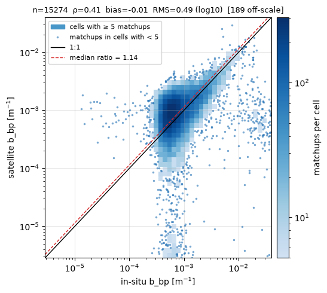
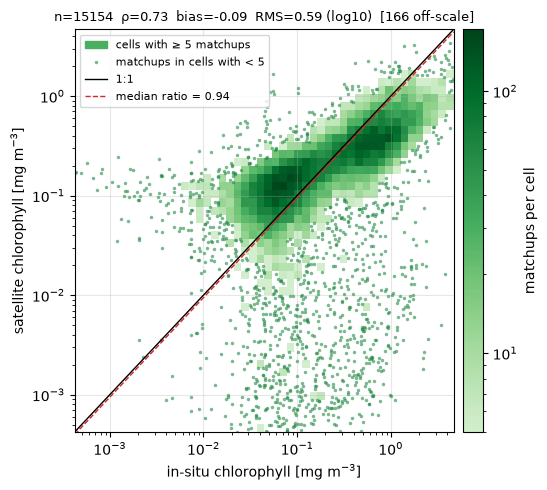
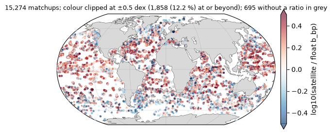
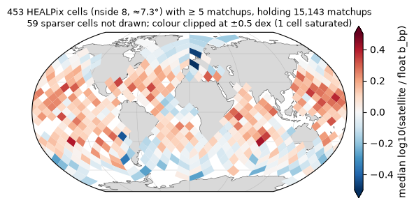
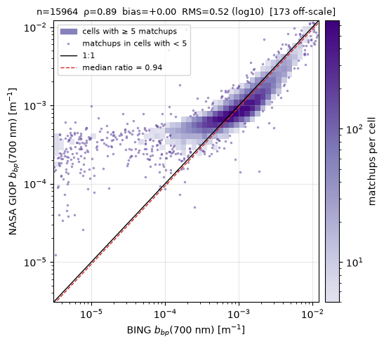
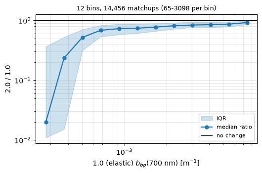
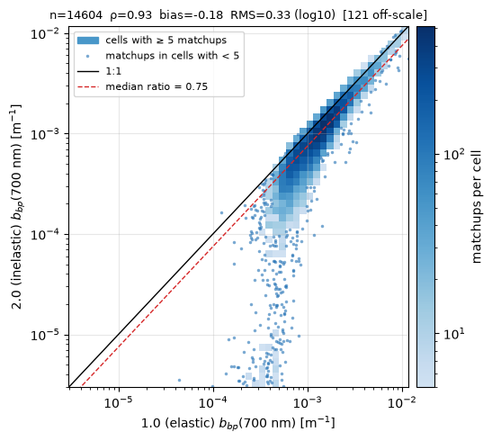
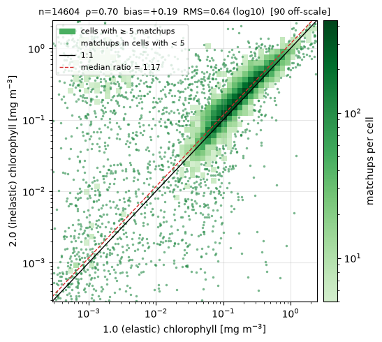
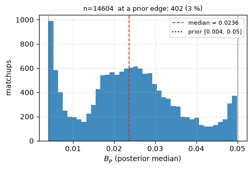

Satellite vs float comparisons
==============================

15,971 matchups — shown as static summary figures (the interactive per-point scatter is suppressed at this scale to keep the committed site small; per-matchup values are in the downloadable summary table on the :doc:`Downloads <downloads>` page).

   Satellite vs float ``b_bp`` (700 nm), log-log; axes span the central 99 % of the values. Filled cells where ≥ 5 matchups fall in a cell, individual points elsewhere; 189 matchups lie outside the axes and are counted in the statistics. The dashed line is the median ratio; the solid line is 1:1. 0 failed retrievals (0.00 %, ``b_bp`` > 1 m⁻¹) excluded.

   Satellite vs float chlorophyll, log-log; axes span the central 99 % of the values. Filled cells where ≥ 5 matchups fall in a cell, individual points elsewhere; 164 matchups lie outside the axes and are counted in the statistics. The dashed line is the median ratio; the solid line is 1:1.

   Matchup locations (one dot per matchup); colour = log10(satellite / float ``b_bp``), symmetric about 0 and clipped at a fixed ±0.5 dex (a factor of 3.2 either way). The 1,818 matchups (11.9 % of the 15,274 with a ratio) at or beyond ±0.5 dex saturate to the end colours. The 695 matchups without a ratio (no float ``b_bp``, or a failed retrieval) are grey; 0 failed retrievals (0.00 %, ``b_bp`` > 1 m⁻¹) excluded.

   Median log10(satellite / float ``b_bp``) per HEALPix cell (nside 8, ≈ 7° cells); only cells holding ≥ 5 matchups are drawn (453 cells, 15,143 matchups; 59 sparser cells left out). The same scale as the dot map: colour = log10(satellite / float ``b_bp``), symmetric about 0 and clipped at a fixed ±0.5 dex (a factor of 3.2 either way); saturated (median at or beyond ±0.5 dex): 1 of the 453 drawn cells. 0 failed retrievals (0.00 %, ``b_bp`` > 1 m⁻¹) excluded.

BING vs NASA GIOP (L2 IOP)
--------------------------

The same PACE overpasses, retrieved two ways: **BING** (this project) against NASA's own **GIOP** retrieval, read from the operational ``PACE_OCI_L2_IOP`` product at the *same pixel* used for the BING fit. See the :doc:`Methods <methods>` page for the product details and provenance.

**Wavelength note:** NASA reports ``b_bp`` at **442 nm** while BING's headline ``b_bp`` is at **700 nm** (chosen to match the float ``BBP700``). NASA's value is shifted to 700 nm with GIOP's own per-pixel power-law slope ``bbp_s``: ``b_bp(700) = b_bp(442) × (442/700)^bbp_s`` (the credible bounds scale by the same factor), so the comparison below is at one wavelength. 14.6 % of the 15,971 slopes sit at GIOP's ceiling of 2.0 — such a slope is a pinned fit rather than a measurement, so those pixels' 700 nm values are the least constrained. For continuity with the previous release, which compared the two as stored, the unadjusted median NASA(442)/BING(700) ratio on the same matchups is 2.16.

- n = 15964; median NASA(700)/BING(700) ratio = 0.938 (IQR 0.748–1.22); Spearman ρ = 0.889; log10 offset = 0.0244, RMS = 0.294; BING 0 failed retrievals (0.00 %, ``b_bp`` > 1 m⁻¹) excluded.

   NASA GIOP ``b_bp`` shifted to 700 nm vs BING ``b_bp`` (700 nm), log-log; axes span the central 99 % of the values. Filled cells where ≥ 5 matchups fall in a cell, individual points elsewhere; 137 matchups lie outside the axes and are counted in the statistics. The dashed line is the median ratio; the solid line is 1:1. BING 0 failed retrievals (0.00 %, ``b_bp`` > 1 m⁻¹) excluded.

1.0 vs 2.0 — elastic vs inelastic retrieval
-------------------------------------------

The **same 14,604 matchups**, fitted twice: the 1.0 results come from the frozen v1 release, the 2.0 results from this one. Rows are paired on matchup **and pixel**, so a difference below is a difference in the retrieval, not in which patch of ocean was looked at. See the :doc:`Methods <methods>` page for the two-database provenance. 48 of the pairs use the 2.0.1 re-fit of a 2.0 fit (the 2.0.1 rows supersede the 2.0 rows of the same matchup and pixel -- see the retrieval-failure note below).

**What changed in 2.0.** The 1.0 fits used the *elastic* Gordon radiative-transfer model: ``Rrs`` is produced by absorption and elastic scattering alone. 2.0 re-fits the same spectra with an **inelastic** forward model:

- **Radiative-transfer backend** — ``robust_hybrid`` (a neural-network emulator of a full RT solution) replaces the analytic ``gordon`` parameterisation.
- **Raman scattering** — water molecules re-emit absorbed blue light at longer wavelengths; included.
- **Chlorophyll fluorescence** — the ~685 nm phytoplankton emission line, at quantum yield ``phi_C = 0.02``; included.
- **CDOM fluorescence** — available in the model but **off** in this run, so none of the results below include it.
- **Free ``B_p``** — the backscatter phase-function parameter, held fixed in 1.0, is a sixth fitted parameter in 2.0 with a uniform prior over ``[0.004, 0.05]``.

The **fit window is unchanged** at 400–700 nm. The red edge (713/719 nm, where Raman and fluorescence are strongest) was evaluated and deliberately left out: on a 97-matchup diagnostic sample Rrs(719) is negative or noise-dominated on **44 %** of matchups, so including it would feed the inelastic terms mostly noise.

- **b_bp(700 nm)** — n = 14,604; median 2.0/1.0 ratio = 0.749 (IQR 0.612–0.876); Spearman ρ = 0.927; log10 offset = -0.181, RMS = 0.325; 0 failed retrievals (0.00 %, ``b_bp`` > 1 m⁻¹) excluded.

- **chlorophyll** — n = 14,604; median 2.0/1.0 ratio = 1.17 (IQR 1.01–1.42); Spearman ρ = 0.695; log10 offset = 0.194, RMS = 0.651.

Result: the inelastic correction is a clear-water effect
~~~~~~~~~~~~~~~~~~~~~~~~~~~~~~~~~~~~~~~~~~~~~~~~~~~~~~~~

The single median ratio understates and overstates by turns, because the shift is a strong, monotonic function of how much backscatter there is to begin with. Split by the 1.0 ``b_bp`` into terciles, the median 2.0/1.0 ratio runs clearest third 0.66; middle third 0.74; most-scattering third 0.81 (tercile edges 0.000975 and 0.00156 m⁻¹), and it keeps going at the extremes: below 2e-4 m⁻¹ the ratio is ~0.02, i.e. 2.0 retrieves some **fifty times less** backscatter than 1.0.

This is the expected behaviour of the physics, not an artifact. Raman scattering and chlorophyll fluorescence contribute a roughly fixed radiance; what varies is how much *elastic* signal sits underneath them. In clear water the elastic contribution is small, so the inelastic terms are a large fraction of ``Rrs`` — and the 1.0 model, which has no inelastic terms at all, could only explain that radiance by inventing particulate backscatter. 2.0 attributes it to the processes that actually produce it, and the retrieved ``b_bp`` drops accordingly. In productive water the elastic signal dominates, the inelastic terms are a small correction, and the two versions converge — the most-scattering tercile differs by only 19 %.

The practical consequence: the headline ratio is a population median and **not** a correction factor to apply to a single retrieval. Which end of this curve a matchup sits on matters more than the median does.

   The 2.0/1.0 ``b_bp`` ratio against the 1.0 value, with the interquartile band. The curve rises from ~0.02 in the clearest water to ~0.95 in the most scattering: the inelastic correction is large where the elastic signal is weak and vanishes where it is strong. Bins with fewer than 20 matchups are not plotted; 0 failed retrievals (0.00 %, ``b_bp`` > 1 m⁻¹) excluded.

**Retrieval failures.** 51 of 15,971 2.0 fits (0.32 %) return ``b_bp(700 nm)`` above 1 m⁻¹, which is not a possible value for seawater (the open ocean spans roughly 1e-4 to 1e-1 m⁻¹); the largest is 9.32e+04 m⁻¹. The same matchups fitted in 1.0 produce 0 such values (maximum 0.0337 m⁻¹), so these are specific to the 2.0 configuration. They were **re-fitted under ``pab_version`` 2.0.1** with physical ceilings on the priors (``prior_set = "bing_standard+ceiling:bbp600<=0.1,adg<=10,aph<=10"`` — ``b_bp`` (600 nm) ≤ 0.1 m⁻¹, ``A_dg`` ≤ 10 m⁻¹, ``A_ph`` ≤ 10 m⁻¹; BING's 10⁻⁶ floors unchanged), on the very spectrum the 2.0 fit saw. 51 of the 51 re-fitted fits now return a ``b_bp`` below the 1 m⁻¹ gate, and **those re-fitted values are what every statistic and figure on this site uses**: a 2.0.1 fit supersedes the 2.0 fit of the same matchup and pixel, the 2.0 rows stay in the database, and the downloadable table says which rows are patched (``pab_version``, ``fit_id_superseded``, ``bbp_bing_superseded``). None remains above the gate; the gate itself stays in force on every ``b_bp`` statistic (0 failed retrievals (0.00 %, ``b_bp`` > 1 m⁻¹) excluded). 11 of the 51 re-fitted fits retrieve a chlorophyll below 0.01 mg m⁻³ — ``A_ph`` at its 10⁻⁶ prior floor, the absorption attributed to ``A_dg`` instead: a retrieval limit that is stated here rather than hidden, since the chlorophyll is not gated. 1 of the re-fitted fits (6990528/121) records ``success = 0`` — the Levenberg–Marquardt warm-start did not converge and the walkers started from the clipped initial guess, as for 144 of the 15,971 2.0 fits — and is kept as recorded.

**What they are.** These are not a clear-water tail — their own retrieved chlorophyll of ~0.01 mg m⁻³ is part of the failed fit. They are marginal-sea spectra (the Baltic above all, the tropical Atlantic, the Arabian Sea) with a depressed or *negative* blue ``Rrs`` at 400–450 nm (the floats under them report a median Chl of 0.93 mg m⁻³, against 0.15 for the population). In this release 156 of 15,971 fitted spectra (0.98 %) have at least one negative band at 400–450 nm (``n_neg_blue`` ≥ 1); 40 of the 51 failed retrievals do. On such a spectrum the Levenberg–Marquardt warm-start delivers the walkers to the ``Bnw`` prior ceiling of 10⁵ m⁻¹, where ``b_b ≫ a`` and the reflectance saturates, and the chains never leave it — although a physical basin with a *better* χ² and a ``b_bp`` within a factor of ~2 of the float exists in every case. The 2.0.1 re-fit above lands in that basin: with the ceilings in place the spurious one is outside the optimiser's reach. The full investigation is `high_bbp_outliers.md <https://github.com/ocean-colour/PAB/blob/main/versions/v2/high_bbp_outliers.md>`__.

(The Chl figures are also the ``A_ph`` figures: BING's chlorophyll is a fixed rescaling of the fitted phytoplankton absorption amplitude, ``Chl = A_ph / 0.05582``, so every ratio statistic is identical. Both columns are in the downloadable table.)

14,604 paired matchups — shown as static figures (the interactive per-point scatter is suppressed at this scale to keep the committed site small).

   2.0 (inelastic) vs 1.0 (elastic) ``b_bp`` (700 nm), log-log, same matchup and same pixel. Filled cells where ≥ 5 matchups fall in a cell, individual points elsewhere; 121 matchups lie outside the axes and are counted in the statistics. The dashed line is the median ratio; the solid line is 1:1. 0 failed retrievals (0.00 %, ``b_bp`` > 1 m⁻¹) excluded.

   2.0 (inelastic) vs 1.0 (elastic) chlorophyll, log-log, same matchup and same pixel. Filled cells where ≥ 5 matchups fall in a cell, individual points elsewhere; 86 matchups lie outside the axes and are counted in the statistics. The dashed line is the median ratio; the solid line is 1:1.

   Posterior-median ``B_p`` across the 14,604 2.0 fits. ``B_p`` was **fixed** in 1.0, so there is no 1.0 counterpart to scatter it against. The dotted lines are the uniform prior's bounds; the fraction within 1 % of an edge is given in the panel title.

**The prior is doing real work at both ends.** The posterior medians are **bimodal**, with mass against *both* bounds of the uniform ``[0.004, 0.05]`` prior: 2.8 % within 1 %, 7.0 % within 2 %, 15.2 % within 5 % of a bound. The 1st percentile sits at the floor and the 99th at the ceiling. A pile-up at a bound means the data preferred a value the prior forbade, so for those fits the bound — not the spectrum — sets ``B_p``. The bounds are physically motivated and have been kept, but the headline ``B_p`` distribution should be read as *censored at both ends* rather than as a free measurement.
