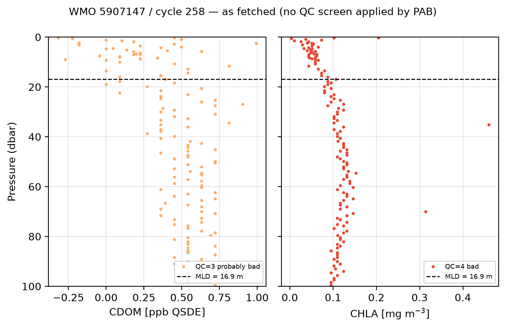
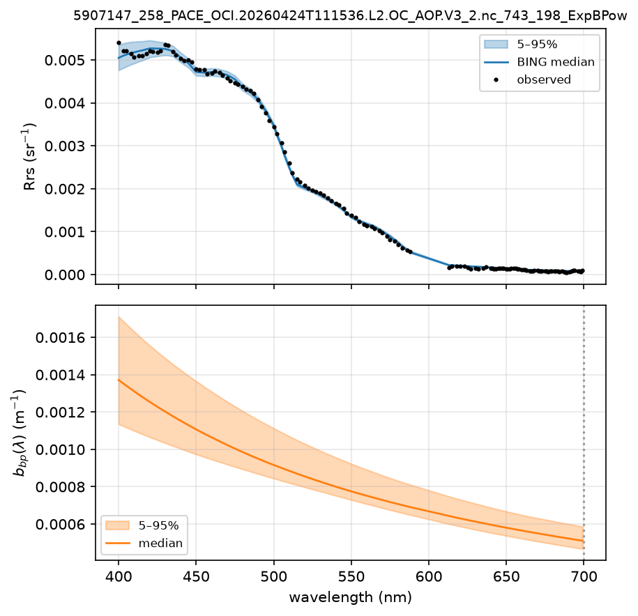
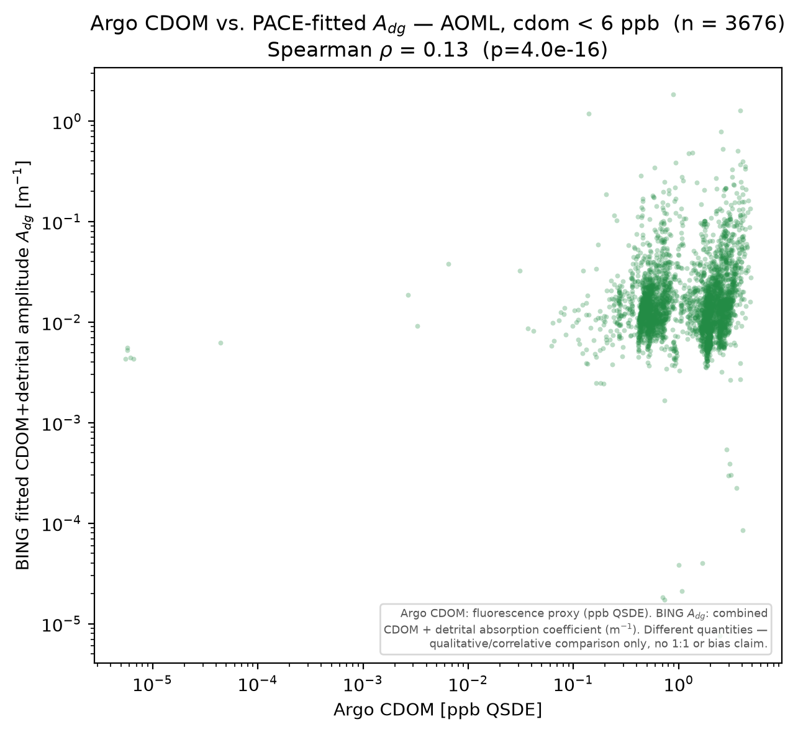
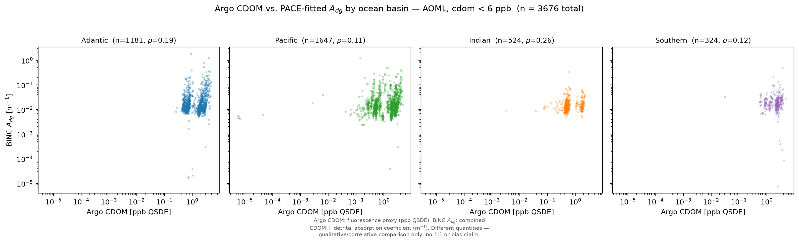
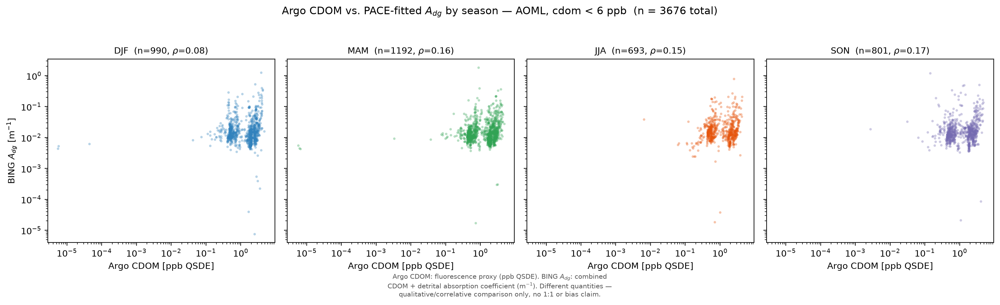
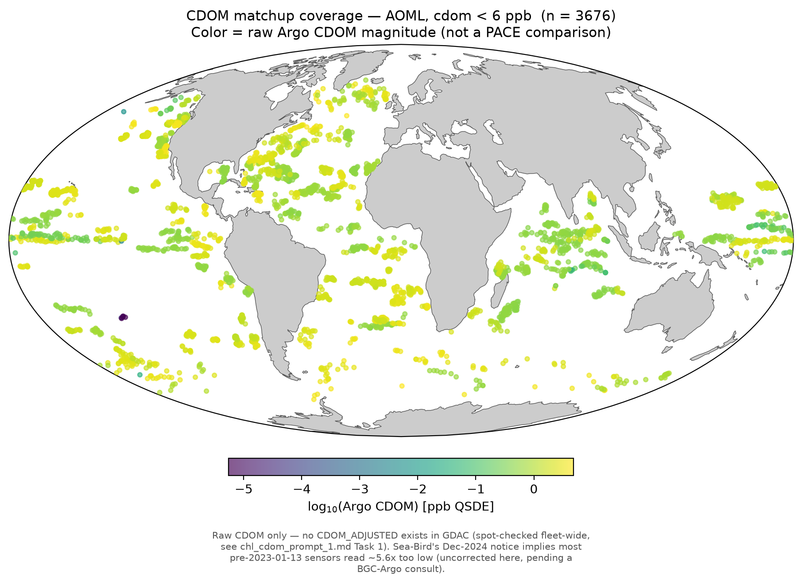
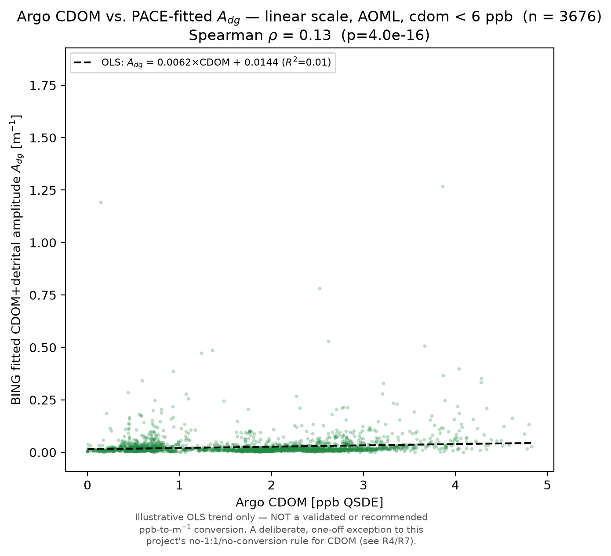
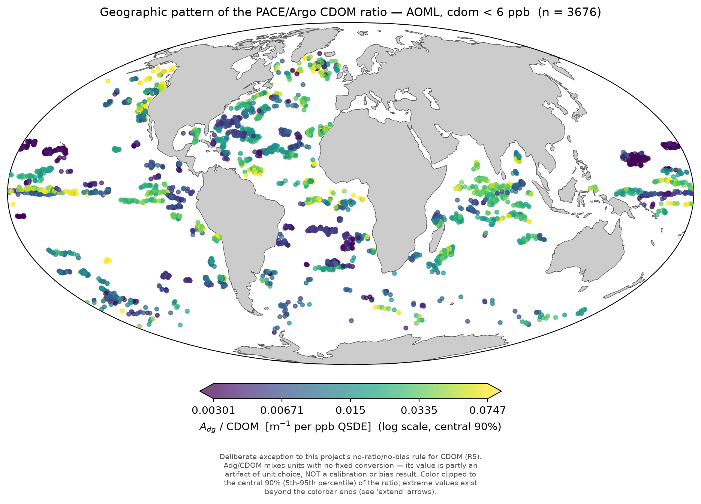

# PACE – Argo CDOM Comparison (Qualitative/Correlative)

**Date:** 2026-09-07
**Database:** `pab.db` (full production run — `pab_version = "1.0"`, 881 floats)
**Scripts:** `pab/matchup/cdom/` — `data.py` (shared loader + caveats),
`plot_cdom_scatter.py`, `plot_cdom_regional.py`, `plot_cdom_seasonal.py`,
`plot_cdom_map.py`, `plot_cdom_linear.py`, `plot_cdom_ratio_map.py`,
`plot_cdom_example_profile.py`, `run_all.py`
**Figures:** `pab/matchup/cdom/*.png`

---

## Why this comparison is qualitative only, not a bias analysis

Unlike the Chl-a and bbp700 deep dives, **this report makes no bias claim,
plots no 1:1 line, and states no "PACE is +X% relative to Argo" number.**
Argo's `CDOM` is a fluorescence proxy in **ppb QSDE** (Quinine Sulfate
Dihydrate Equivalent); the nearest PACE-side retrieval, BING's
`ExpBPow_Adg`, is the amplitude of a **combined CDOM + particulate detrital**
absorption term in **m⁻¹** — a different physical quantity, in different
units, with no fixed conversion between them. A ppb→absorption factor exists
only empirically and is instrument- and region-dependent; PAB does not invent
one. Every figure below carries this caveat explicitly, and the comparison is
restricted throughout to rank correlation (Spearman ρ) and qualitative
regional/seasonal pattern-matching, per the plan agreed in
`claude_prompts/chl_cdom_matchups.md` (C1–C4).

**A second, independent caveat: raw CDOM only, with a known, unapplied,
manufacturer-identified calibration bias.** Sea-Bird Scientific (who make the
CDOM fluorometers on BGC-Argo floats) issued a customer notice (2024-12-11)
that **all SBS CDOM fluorometers calibrated/serviced before 2023-01-13** —
most of the historical Argo fleet, given multi-year deployments — read
**~5.6x too low**, with a determined Reference Adjustment Factor (RAF) of
**5.62**. A second, separate sensor-reference bias is also documented but has
no published correction factor. A direct spot-check against live GDAC data
(`chl_cdom_prompt_1.md`, Task 1) found this correction is **not baked into
any archived value**: `CDOM_ADJUSTED` is entirely empty, fleet-wide — no
BGC-Argo float has ever had CDOM delayed-mode processed (confirmed again
below: 100% of this analysis's matchups carry `cdom_data_mode = 'R'`). Every
CDOM value plotted here is therefore raw, uncorrected, and — for most
pre-2023 sensors — likely reading substantially low relative to what a
corrected value would show. JXP has indicated an intent to apply a correction
after consulting BGC-Argo colleagues; that has not happened yet, and no
correction is applied or estimated here.

---

## Summary

**Refinement pass (chl_cdom_matchups.md R1–R8).** The population is now
restricted to **AOML-processed floats with raw CDOM < 6 ppb QSDE**
(n=3,676), replacing the earlier unrestricted population (n=7,083). The
original unrestricted figures/numbers are recoverable in git history; they
are not reproduced below.

**Headline result: under this restriction, the CDOM-Adg correlation flips
sign and strengthens.** The overall Spearman ρ moves from -0.03 (practically
zero, unrestricted) to **+0.13** (p=4.0e-16) — and, unlike before, where
signs were mixed and near-zero everywhere, **every basin and every season
now shows a positive correlation** (ρ ranging from +0.08 to +0.26). The
correlation remains weak-to-moderate in absolute terms, but the qualitative
change — from "no relationship anywhere" to "a consistent positive
relationship everywhere" — is a substantive finding, not noise. This change
is driven almost entirely by the **AOML restriction**, not the CDOM < 6 cut:
the AOML-only subset of the old population was already 3,690 matchups, and
the CDOM < 6 cut removes only 14 more (7,065 of the original 7,083 already
satisfied it).

Two new figures are added, and **both are deliberate, one-off exceptions to
this report's own C3 rule** (never showing a 1:1/fit line or cross-unit bias
statistic for CDOM, since Argo CDOM in ppb QSDE and BING's `Adg` in m⁻¹ have
no fixed conversion):

- **Figure 5** — the same comparison on a linear scale, with a fitted OLS
  trend line, captioned explicitly as illustrative only, not a validated
  conversion.
- **Figure 6** — a geographic map of the literal cross-unit ratio
  `Adg`/CDOM — exactly the kind of bias-like presentation C3 exists to
  prevent, shown here as a qualitative visual only, with a prominent caveat.

**This refined result is not the final word.** Two requested refinements
remain open and deferred to a future re-ingestion pass: Argo QC-flag
filtering (R2 — no per-level QC flags are stored in `pab.db`, only an
already-averaged mixed-layer mean, so this cannot be applied retroactively)
and a split by CDOM sensor model (R6 — feasible via a float-level GDAC
meta-file fetch, but not built in this update). **No QC screening is applied
even to this restricted, AOML-only population.**

**One important methodological point carried over from the unrestricted
analysis:** Spearman rank correlation is invariant under any monotonic
increasing transform of either variable. Since the Sea-Bird RAF (multiplying
every raw CDOM value by the constant 5.62) is exactly such a transform,
**applying the still-pending correction would not change any of the rank
correlations reported here** (though it would change Figure 5's OLS slope,
which is fit in absolute, not rank, units).

---

## Data

Built from `pab.matchup.chl.data.load_chl_matchups()` (the CDOM population is
a subset of the exact same joined matchup table the Chl-a report draws from)
via `pab.matchup.cdom.data.valid_cdom()` + `restrict_to_aoml()`, applying two
cuts to the previous unrestricted set of 7,083:

1. **AOML-processed floats only** (`floats.data_center == 'AO'`).
2. **Raw CDOM < 6 ppb QSDE** (strict).

The AOML restriction does essentially all the work: AOML-only within the old
population was already 3,690 matchups, and the CDOM < 6 cut removes only 14
more. This restricted population (n=3,676) replaces the old unrestricted set
in every figure below.

| | Old (n=7,083, all DACs) | New (n=3,676, AOML only) |
|---|---|---|
| Overall Spearman ρ | -0.03 | **+0.13** (p=4.0e-16) |
| Atlantic | -0.06 | **+0.19** (n=1,181) |
| Pacific | +0.19 | **+0.11** (n=1,647) |
| Indian | +0.06 | **+0.26** (n=524) |
| Southern | -0.09 | **+0.12** (n=324) |
| DJF | -0.03 | **+0.08** (n=990) |
| MAM | -0.03 | **+0.16** (n=1,192) |
| JJA | -0.06 | **+0.15** (n=693) |
| SON | +0.01 | **+0.17** (n=801) |

`cdom_data_mode` is still 100% `'R'` (real-time) in the restricted population
— the AOML cut does not change this fleet-wide fact.

Note: the worked example in the Methodology section below (float WMO
5907147) is Coriolis-processed (`data_center = 'IF'`) and therefore falls
outside this restricted AOML-only population. It remains in the report as-is
because it illustrates the general Argo-ingestion/BING-fitting *methodology*,
not this specific AOML cut.

---

## Methodology

### Argo: CDOM ingestion and processing

CDOM profiles are fetched via `argopy`'s BGC `DataFetcher` (`ds='bgc',
src='gdac', mode='expert'`), the same mechanism already used for CHLA and
BBP700; `"CDOM"` was added to `pab/argo/fetch.py::DEFAULT_PARAMS` in the
Stage 10 pass. For each profile, `pab/argo/fetch.py::iter_profiles` extracts
the per-level `CDOM` array along with the per-parameter `CDOM_DATA_MODE`.

`pab/argo/summary.py::summarize_profile` then computes a mixed-layer mean and
standard deviation of CDOM as a plain arithmetic mean over all levels within
the mixed layer. No de-spiking and no IQR outlier rejection are applied —
that treatment is BBP700-specific (following Bisson et al.'s recipe); CHLA
and CDOM both receive the plain mean.

Two limitations of this ingestion path should be stated plainly:

1. **No QC-flag filtering is applied.** This was verified directly against
   the live pipeline code rather than assumed. A
   `pab.argo.fetch.filter_quality()` function exists (default: keep QC flags
   1 and 2), but a repo-wide search confirms it has zero call sites in
   `pab/pipeline.py` or anywhere else in the ingestion path. `fetch_profile()`
   calls `build_fetcher(...).profile(wmo, cycle).load().data` and hands the
   raw fetched dataset directly to `iter_profiles`/`summarize_profile`.
   Consequently, every per-level CDOM (and CHLA) value within the mixed layer
   is averaged in regardless of its Argo QC flag (1 = good, 2 = probably
   good, 3 = probably bad, 4 = bad).
2. **All CDOM values are real-time.** A fleet-wide spot-check during the
   implementation pass found `cdom_data_mode` to be 100% `'R'`: no BGC-Argo
   float has had CDOM delayed-mode/QC-reprocessed by any DAC. Every CDOM
   value in this analysis is therefore real-time, unfiltered, and
   uncorrected for the known Sea-Bird calibration low-bias discussed
   elsewhere in this report.

The resulting `cdom`, `cdom_std`, and `cdom_data_mode` are persisted into the
`mld_summary` table (schema v4) via `persist_summary()`, keyed by
`profile_id`.

### PACE/BING: the fitted Adg amplitude

BING is the Bayesian MCMC spectral-inversion framework PAB uses to fit each
matchup's nearest-pixel PACE `Rrs(λ)` spectrum (400–700 nm). All fits in this
report use the `ExpBPow` model pair (Exponential–Bricaud a_ph + power-law
particulate backscatter). Each fit is an LM warm-start followed by full MCMC
(`emcee`), producing a posterior over the model parameters.

`Adg` is the amplitude of an exponential CDOM+detrital absorption term of the
form `A_dg * exp[-S_dg * (wavelength - 400)]`. It is a term in the
*satellite* radiative-transfer/absorption model — not any processing of the
Argo CDOM measurement. It has no knowledge of, and is not tuned against,
in-situ CDOM in any way, which is part of why this report's comparison is
strictly qualitative.

Every fit stores 10 posterior IOP quantities in the long-format
`fit_results` table (as `BING_ExpBPow_<quantity>`), each recorded as a
posterior median plus a 5–95% credible interval (`value`, `value_lo`,
`value_hi`). `Adg` (`BING_ExpBPow_Adg`) is one of these 10.

---

## Example: One Float, One Matchup, One Fit

To make the pipeline concrete, this section walks one real matchup end to
end: float WMO 5907147, cycle 258 (43.08°N, 9.11°E, 2026-04-24), which pairs
with a PACE granule fitted by BING. This is the same matchup used in Figure
1's scatter — not a cherry-picked illustration built separately from the
analysis population.

### The Argo profile



The figure shows CDOM and CHLA vs. pressure as fetched — no QC screen
applied by PAB — with points colored by their Argo QC flag and the 16.9 m
mixed-layer depth marked as a dashed line. The stored `mld_summary` row for
this profile is:

| Quantity | Value |
|---|---|
| `mld` | 16.9 m |
| `cdom` | 0.219 ppb QSDE |
| `cdom_std` | 0.279 |
| `cdom_data_mode` | `'R'` |
| `chla` (raw) | 0.057 mg/m³ |
| `chla_adjusted` | 0.032 mg/m³ |
| `chla_data_mode` | `'A'` |
| `n_points` | 45 |

Note that `cdom_std` exceeds half the mean — a noisy real-time signal. A
fresh live re-fetch of this exact profile (via the same `argopy` path, no
filtering) found that every CDOM point in the profile carries Argo QC flag 3
("probably bad") and every CHLA point carries QC flag 4 ("bad") — none were
QC 1 or 2. All of these unscreened points are what got averaged into the
`mld_summary` values above. This is a concrete illustration, for this one
profile, of the no-QC-filtering behavior documented in the Methodology; it
is not a claim about the QC-flag distribution of the fleet as a whole.

### The BING fit



The figure is PAB's standard two-panel fit figure
(`pab.plotting.fit_fig.fit_figure`): the top panel shows the observed vs.
BING-median `Rrs(λ)` with a 5–95% credible band; the bottom panel shows the
retrieved `b_bp(λ)` spectrum with its own credible band, 700 nm marked.
(This format predates the CDOM work and does not plot `Adg` directly.) The
fit here is a real production fit, reconstructed from its archived MCMC
chain — visual agreement between observed and median Rrs is excellent
across the full 400–700 nm range with a narrow credible band, and the
retrieved `b_bp(λ)` declines smoothly.

- `fit_id`: `5907147_258_PACE_OCI.20260424T111536.L2.OC_AOP.V3_2.nc_743_198_ExpBPow`
- Reduced `chisq = 0.093` (well below 1), `success = True`

Retrieved quantities (posterior median [5–95% interval]):

| Quantity | Value |
|---|---|
| `Adg` | 0.036 [0.032, 0.045] m⁻¹ |
| `Sdg` | 0.018 |
| `chl` | 0.152 mg/m³ |
| `bbp700` | 0.00051 m⁻¹ |
| `Aph` | 0.0085 |
| `Bnw` | 0.00067 |
| `beta` | 1.81 |

(For context only: BING's `chl` of 0.152 mg/m³ sits well above this
profile's Argo raw chla of 0.057 and adjusted chla of 0.032 mg/m³, but
chlorophyll is outside this report's scope.)

This fit's `Adg = 0.036 m⁻¹` is the value paired against this profile's
mixed-layer CDOM of 0.219 ppb QSDE as one point in the Figure 1 scatter.

---

## Figure 1 — Argo CDOM vs. PACE-fitted Adg

**File:** `cdom_vs_adg_scatter.png`



**Key observations:**
- No 1:1 line, by design (see above). Spearman ρ = **+0.13** (n=3,676,
  p=4.0e-16) — a real, if modest, positive rank correlation, a sign flip and
  strengthening from the unrestricted population's ρ=-0.03.
- CDOM values now span roughly six orders of magnitude within this
  AOML-only, cdom<6 population (a small cluster near ~10⁻⁵ ppb, then a
  bimodal main cluster between ~0.1 and ~5 ppb); `Adg` still spans roughly
  two-to-three orders of magnitude for any given CDOM value — the
  correlation is real but far from tight.
- A handful of very low `Adg` values (down to ~10⁻⁵ m⁻¹) still occur at
  moderate-to-high CDOM, and a few very low-CDOM points (~10⁻⁵ ppb) pair with
  ordinary-magnitude `Adg` — neither extreme is common enough to drive the
  overall correlation.

---

## Figure 2 — Regional Pattern: by Ocean Basin

**File:** `cdom_vs_adg_by_basin.png`



**Key observations:**
- **Every basin is now positive**: Atlantic ρ=+0.19 (n=1,181), Pacific
  ρ=+0.11 (n=1,647), Indian ρ=+0.26 (n=524, the strongest of the four),
  Southern ρ=+0.12 (n=324) — a marked change from the unrestricted
  population, where signs were mixed (Atlantic and Southern were negative).
- Still, no basin approaches the strong rank agreement seen in the
  Chl-a-vs-Argo comparison (ρ=0.78) — CDOM/`Adg` agreement is real but
  consistently weak-to-moderate, everywhere.
- The visible bimodal clustering of CDOM values (two dense vertical bands,
  roughly 0.1-1 and 1-3 ppb) appears in every basin, not just one — likely a
  real feature of the AOML fleet's CDOM distribution rather than a
  basin-specific artifact.

---

## Figure 3 — Seasonal Pattern

**File:** `cdom_vs_adg_seasonal.png`



**Key observations:**
- **Every season is now positive**: DJF ρ=+0.08 (n=990, the weakest), MAM
  ρ=+0.16 (n=1,192), JJA ρ=+0.15 (n=693), SON ρ=+0.17 (n=801) — again a
  marked change from the unrestricted population's near-zero/mixed-sign
  seasonal pattern.
- DJF being the weakest of the four (though still positive) is a mild
  seasonal modulation worth noting, but not large enough to argue for a
  specific productivity- or season-driven mechanism on this evidence alone.
- The positive correlation is consistent enough across all four seasons that
  a seasonal confound is not needed to explain the headline result — the
  AOML restriction alone (Data section) accounts for the bulk of the change.

---

## Figure 4 — Global Coverage

**File:** `cdom_global_map.png`



**Key observations:**
- Descriptive only: color encodes raw Argo CDOM magnitude, not a PACE
  comparison (per C3, no bias metric exists for CDOM).
- Coverage now shows the AOML-only subset (dense in the North Atlantic,
  Mediterranean, and along several zonal ship-track-like bands; sparser in
  the Indian Ocean and high Southern Ocean) rather than the full multi-DAC
  fleet.
- One visibly isolated dark point in the South Pacific (~29°S, 139°W) is a
  cluster of the population's **lowest** CDOM values (~6×10⁻⁶ ppb, verified
  directly against the data) — not the highest, correcting an
  easy-to-mis-scan reading of the color scale. The highest CDOM values
  (~4.8 ppb, near the CDOM<6 cutoff) are scattered across several basins
  (South Atlantic, Caribbean, eastern tropical Pacific) with no single
  standout hot-spot. This map is provided for coverage/context, not as
  evidence for or against any hypothesis about the CDOM/`Adg` relationship.

---

## Figure 5 — Linear-Scale Comparison with an Illustrative OLS Trend Line

**File:** `cdom_vs_adg_linear.png`



**Key observations:**
- Per R4/R7, this is a deliberate, one-off exception to the no-fit-line rule
  applied to every other CDOM figure in this project: a fitted slope across
  different units reads as a proposed ppb→m⁻¹ conversion factor, which this
  is explicitly not. The figure is captioned on the plot itself as
  "illustrative OLS trend only — NOT a validated or recommended
  ppb-to-m⁻¹ conversion."
- The OLS fit is `Adg = 0.0062 × CDOM + 0.0144`, with **R² = 0.01** — the fit
  explains almost none of the variance despite the positive rank correlation
  (ρ=+0.13) reported elsewhere in this report. Spearman ρ and R² measure
  different things: a weak-but-real *rank* relationship does not imply a
  strong *linear* one.
- The bulk of points cluster at low CDOM (0-2 ppb) and low `Adg` (0-0.1
  m⁻¹); a handful of outliers extend to CDOM ≈ 5, `Adg` ≈ 1.2-1.3.
- The fit line is nearly flat: the relationship, while positive in rank, is
  not well described by a straight line over this range — most of the
  signal lies in which points are relatively higher or lower than others,
  not in a proportional scaling.

---

## Figure 6 — Geographic Map of the Adg/CDOM Ratio

**File:** `cdom_ratio_map.png`



**Key observations:**
- Per R5/R8, this is also a deliberate, explicitly-flagged exception to the
  no-ratio rule applied everywhere else in this report: a literal cross-unit
  ratio (m⁻¹ per ppb QSDE) is precisely the kind of bias-like quantity C3
  exists to prevent. It is presented as a qualitative visual only, with the
  caveat stamped on the figure itself.
- Color shows `Adg`/CDOM on a log scale, clipped to the central 90% of
  values (5th percentile ≈ 0.00301, median ≈ 0.01335, 95th percentile ≈
  0.07474 m⁻¹ per ppb QSDE), with `extend='both'` colorbar arrows marking
  that more extreme values exist beyond the shown range — the full ratio
  spans 8.5 orders of magnitude.
- No single dominant regional hot-spot or cold-spot is obvious at a glance —
  the color pattern looks broadly patchy/mixed rather than cleanly zonal or
  coastal-vs-open-ocean.
- No quantitative regional breakdown of the ratio itself was computed (only
  the CDOM-`Adg` *correlation* was broken out by basin/season, in the Data
  section table above); this map is a qualitative visual only, consistent
  with C3's spirit even though the ratio itself is a conscious exception to
  it.

---

## Interpretation

1. **Restricted to AOML, CDOM and the fitted `Adg` amplitude show a real,
   if weak-to-moderate, positive rank correlation — everywhere.** The
   overall ρ=+0.13 is small but not practically zero, and every basin
   (ρ=+0.11 to +0.26) and every season (ρ=+0.08 to +0.17) agrees in sign.
   This supersedes the unrestricted population's finding (ρ≈0 with mixed
   signs across strata) — see point 5 below for why.

2. **This is not an artifact of the unapplied Sea-Bird correction.** Spearman
   ρ is invariant under a uniform multiplicative rescaling, so applying the
   RAF (5.62x) to every raw CDOM value — if that is what the eventual
   correction turns out to be — would not change any rank correlation
   reported here (it would change Figure 5's OLS slope, which fits absolute
   values). If the eventual, fuller correction (including the second,
   currently-unpublished sensor-reference bias) is *not* a uniform factor,
   this conclusion would need to be revisited; that cannot be evaluated until
   that correction is published.

3. **Plausible reasons the correlation is real but still only
   weak-to-moderate, not confirmed here** (out of scope for a qualitative
   comparison, but worth naming for follow-on work):
   - **`Adg` is a combined quantity.** JXP's own framing when scoping this
     comparison (C3) anticipated detrital absorption is generally much
     smaller than CDOM absorption; a weak-but-real correlation is at least
     consistent with that expectation (a dominant detrital term would more
     likely erase the signal entirely) without confirming it.
   - **Unit/quantity mismatch nonlinearity.** A fluorescence proxy (ppb QSDE)
     and an absorption coefficient (m⁻¹) need not be linearly related even
     where they are monotonically related — consistent with Figure 5's weak
     R² alongside a real Spearman ρ.
   - **CDOM sensor data quality.** Every value used here is real-time only —
     no BGC-Argo float has ever had CDOM delayed-mode quality control applied
     (corroborating the fleet-wide spot-check in `chl_cdom_prompt_1.md`) —
     so real-time-grade sensor noise is plausibly larger, relative to the
     signal, than for the more mature CHLA/BBP700 QC pipelines, and no QC
     screening is applied here regardless (R2, deferred).

4. **Net assessment:** this comparison now supports a real, if modest,
   physical relationship between BING's `Adg` and in-situ CDOM — but only
   within the AOML subset, and only on unfiltered, uncorrected raw data.
   `Adg` is not yet established as a usable general-purpose proxy for in-situ
   CDOM. The companion Chl-a report's `Adg`-vs-Chl-bias correlation (ρ=-0.24)
   should not be read as validating `Adg` against CDOM directly — that
   finding and this one address different questions.

5. **The sign-flip under the AOML restriction is the central new
   take-away of this refinement pass.** Restricting to AOML-processed floats
   moves the overall Spearman ρ from -0.03 to +0.13 and turns every basin and
   season positive, while the accompanying CDOM < 6 cut changes almost
   nothing on its own (Data section). The most natural reading is that
   non-AOML DACs' CDOM data — or their processing conventions — were adding
   enough noise or inconsistency to wash out a real signal that AOML's data
   reveals more cleanly. This is consistent with, though does not prove, a
   DAC-specific data-quality or convention difference, paralleling a similar
   AOML-vs-other-DACs pattern already noted in the companion Chl-a report.
   The natural next steps are the two deferred refinements: applying Argo
   QC-flag screening (R2) and splitting by CDOM sensor model, `MCOMS_FLBBCD`
   vs. `ECO_FLBBCD` (R6), to test whether the signal strengthens further
   under either.

---

## How to Reproduce

```bash
cd /path/to/PAB
conda activate ocean14

# Regenerate every figure and print the headline correlations
python -m pab.matchup.cdom.run_all --outdir pab/matchup/cdom
```

Individual figures:

```bash
python -m pab.matchup.cdom.plot_cdom_scatter --out cdom_vs_adg_scatter.png
python -m pab.matchup.cdom.plot_cdom_regional --out cdom_vs_adg_by_basin.png
python -m pab.matchup.cdom.plot_cdom_seasonal --out cdom_vs_adg_seasonal.png
python -m pab.matchup.cdom.plot_cdom_map --out cdom_global_map.png
python -m pab.matchup.cdom.plot_cdom_linear --out cdom_vs_adg_linear.png
python -m pab.matchup.cdom.plot_cdom_ratio_map --out cdom_ratio_map.png
```

All five figure scripts (scatter, by-basin, by-season, map, linear, ratio
map) restrict to AOML floats with `cdom < 6` by default
(`pab.matchup.cdom.data.valid_cdom()` + `restrict_to_aoml()`); there is no
CLI flag to reproduce the old unrestricted population — use the git history
of this file/these scripts if the unrestricted figures are needed again.

All scripts accept `--db` (default: `$PAB_DATA_DIR/pab.db`).

---

## Notes

- All scripts are in `pab/matchup/cdom/`, reusing the Chl-a report's shared
  loader (`pab.matchup.chl.data.load_chl_matchups()`) rather than a separate
  query path — the CDOM matchup population is a strict subset of the same
  joined table.
- **No `cdom_adjusted` field exists in `pab.db`.** Per `chl_cdom_prompt_1.md`
  Q1, JXP chose to ingest raw `cdom` only, deferring any Sea-Bird correction
  pending a BGC-Argo consult. When that correction is applied and re-ingested,
  Interpretation point 2 above explains exactly when this report's
  conclusions would (and would not) need revisiting.
- This report is intentionally narrower in scope than the Chl-a report: no
  bias number, no 1:1 line, and no claim about which quantity is "more
  correct" — per C3, that is a deliberate, agreed limitation given the
  units/quantity mismatch, not an oversight. Figures 5 and 6 are named,
  one-off exceptions to this rule (R4/R5), not a reversal of it.
- QC-flag filtering (R2) and the CDOM sensor-model split (R6) were both
  requested but are **deferred to a future re-ingestion pass**, not silently
  dropped: the current matchup files store only an already-averaged
  mixed-layer CDOM mean with no per-level QC flags (so QC screening requires
  a real re-ingestion), and the sensor split, while feasible via a
  float-level GDAC meta-file fetch, was not built in this update. Even the
  restricted AOML-only population presented here carries no QC screening.
