# PACE – Argo Chl-a Matchup Analysis

**Date:** 2026-09-07
**Database:** `pab.db` (full production run — `pab_version = "1.0"`, 881 floats)
**Scripts:** `pab/matchup/chl/` — `data.py` (shared loader), `plot_chl_scatter.py`,
`plot_chl_histogram.py`, `plot_chl_maps.py`, `plot_chl_stratification.py`,
`plot_chl_quality.py`, `plot_chl_diagnostics.py`, `plot_chl_adjusted.py`,
`plot_chl_dac.py`, `run_all.py`
**Figures:** `pab/matchup/chl/*.png` (+ `chl_global_map.html`, interactive, internal only)

---

## Summary

Unlike `bbp700` — a straightforward mixed-layer average compared against a
BING backscatter retrieval — PACE Chl-a (`chl_bing = 10**Aph / 0.05582`) is a
*retrieval*, and this analysis set out explicitly not to assume its bias looks
like bbp700's. It doesn't. Across **9,814 valid matchups** (of 14,609 with a
BING `ExpBPow` fit), PACE Chl-a exceeds Argo in **58%** of matchups with a
median relative difference of **+0.13** — a real but much weaker and noisier
positive bias than bbp700's 84% / +0.35 (`pace_argo_bbp700_bias_analysis.md`).

More importantly, the bias is **not a constant offset — it changes sign with
Chl-a concentration.** PACE reads systematically *low* relative to Argo below
roughly 0.1–0.2 mg/m³ and systematically *high* above it (octile medians run
from about +0.65 at the lowest concentrations to about −0.8 at the highest).
A single multiplicative or additive correction cannot describe this
population; any interpretation has to engage with *why* the sign flips, not
just the median.

**Two caveats about the in-situ reference itself turn out to be as
consequential as anything on the PACE side, and are treated with that
weight here rather than as a footnote:**

1. **Raw vs. adjusted Argo Chl-a.** PAB's production run used Argo's raw,
   real-time `CHLA` (per `argo_mode="expert"`, chosen because the alternative
   modes return no data for many real-time profiles). The Stage 10
   re-ingestion pass added the delayed-mode/real-time-adjusted `CHLA_ADJUSTED`
   field alongside it. The adjusted values run **substantially lower** than
   raw (median adjusted/raw ratio **0.46** — adjustment roughly halves the
   reported concentration, consistent with an NPQ-type correction). Recomputing
   the bias against the adjusted reference **more than quadruples** the median:
   **+0.13 → +0.58** (same 9,168-matchup population). Which number is "the"
   PACE-vs-Argo bias depends entirely on which Argo Chl-a is trusted as ground
   truth — a bigger swing than any geometric, quality, or regional
   stratification below produces.
2. **The correction-provenance gap.** PAB cannot currently determine *which*
   correction algorithm produced a given `CHLA_ADJUSTED` value — Argo's
   per-parameter calibration metadata (`SCIENTIFIC_CALIB_*`) is not ingested,
   and DACs are not required to apply the same delayed-mode procedure. "Raw"
   and "adjusted" both have real uncertainty; neither is an unambiguous
   truth.

A related, DAC-specific pattern reinforces this: floats processed by **AOML**
(the majority DAC in this matchup set, 5,894/9,750 with known provenance) show
a much smaller median bias (**+0.06**) than all other DACs combined
(**+0.25**) — a gap that plausibly reflects processing/calibration-convention
differences across DACs rather than a PACE retrieval effect that varies by
float manufacturer.

Candidate physical mechanisms fare more modestly: a weak negative correlation
between the bias and the fitted CDOM/detrital amplitude (`Adg`, ρ=-0.24) is
consistent with (not proof of) CDOM/detritus aliasing into the Bricaud
phytoplankton term at high `Adg`; the bbp700 retrieval bias is essentially
uncorrelated with the Chl bias (ρ=0.09), so they do not share a single root
cause; and restricting to the highest-quality matchups (low cloud cover, good
BING fits) *increases* the median bias (+0.13 → +0.22, n=2,023) — as with
bbp700, poor PACE data quality is not the explanation for the positive tail.

---

## Data

All figures draw from the full-mission `pab.db` via
`pab.matchup.chl.data.load_chl_matchups()`, which wraps
`pab.metrics.compare.gather_matchups()` + `add_strata()` and adds the joins
this analysis needs: `matchups.distance_km`/`dtime_hours`,
`mld_summary.mld`/`chla_adjusted`/`cdom`/`chla_data_mode`,
`floats.data_center`/`project_name` (the Stage 10 DAC-provenance fix),
`granules.cloud_cover`, and the fitted `BING_ExpBPow_Adg` amplitude.

| | Value |
|---|---|
| Matchups with a BING `ExpBPow` fit | 14,609 |
| Valid for this analysis (finite, positive `chl_bing`/`chla_argo`, \|rel_diff\| ≤ 1.5) | **9,814** |
| Matchups with `chla_adjusted` populated | 9,168 (93.4% of valid) |
| Matchups with known `data_center` | 9,750 (99.3% of valid) |

**Relative difference** follows the project convention:
```
rel_diff = (chl_bing − chla_argo) / chl_bing
```
The ~4.8k matchups excluded from the valid set lack a usable Argo Chl-a value
at all (NaN or non-positive), or exceed the ±1.5 outlier screen carried over
from the bbp700 precedent — not a code defect.

---

## Figure 1 — Distribution of Relative Differences

**File:** `chl_reldiff_histogram.png`

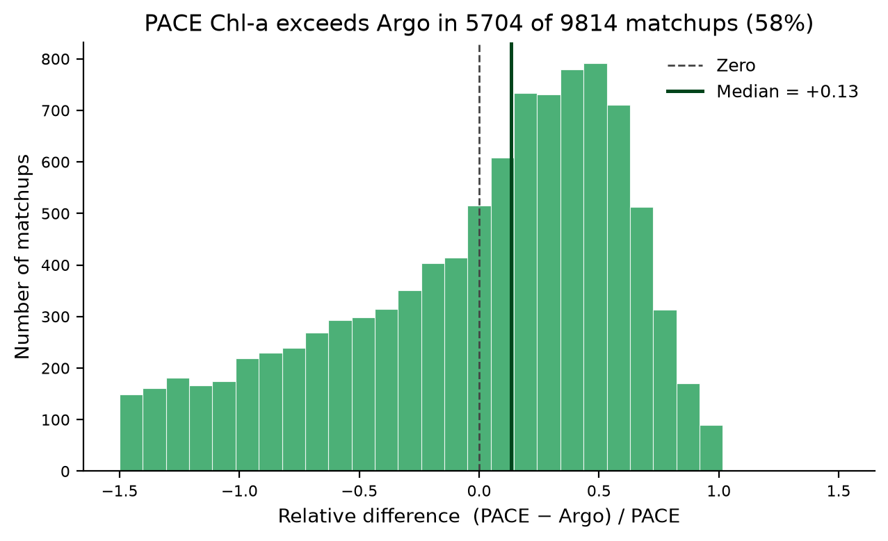

**Key observations:**
- 5,704 of 9,814 matchups (58%) are positive — PACE exceeds Argo, but far
  less lopsidedly than bbp700's 84%.
- The median is +0.13; the distribution is broad and only mildly skewed
  positive, with substantial density on both sides of zero.
- Unlike bbp700's histogram (strongly right-skewed, a single dominant mode),
  this one is closer to symmetric-but-shifted — consistent with the
  concentration-dependent sign flip in Figure 3 mixing two different regimes
  together in one plot.

---

## Figure 2 — PACE vs. Argo Chl-a (1:1 scatter)

**File:** `chl_pace_vs_argo_scatter.png`

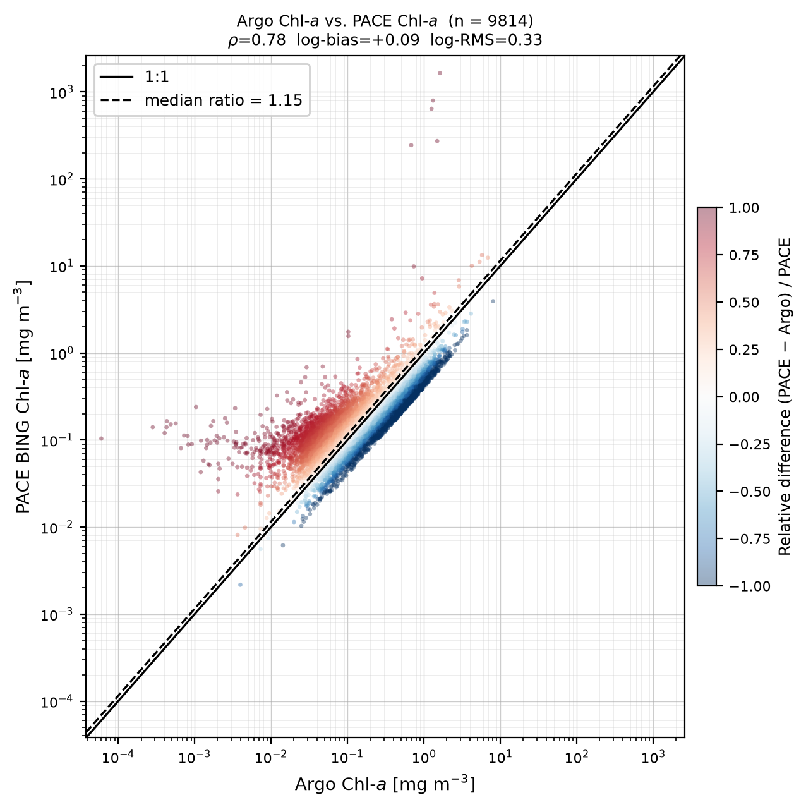

**Key observations:**
- Strong rank agreement overall (Spearman ρ = 0.78) — PACE and Argo agree on
  *relative* Chl-a ordering across nearly four decades of concentration.
- Log-space bias +0.09, RMS 0.33, median ratio 1.15 — small in aggregate, but
  these single numbers hide the pattern below: points below the 1:1 line
  cluster at low Argo Chl-a (< ~0.1 mg/m³) and points above it cluster at
  higher concentrations, exactly the sign flip quantified in Figure 3.
- A cluster of points near `chl_bing ≈ 0.1` mg/m³ across a wide range of Argo
  values suggests a retrieval floor/prior boundary in the BING fit at low
  signal — worth a closer look in a future pass, not resolved here.

---

## Figure 3 — Relative Difference vs. Chl-a Magnitude

**File:** `chl_reldiff_vs_magnitude.png`

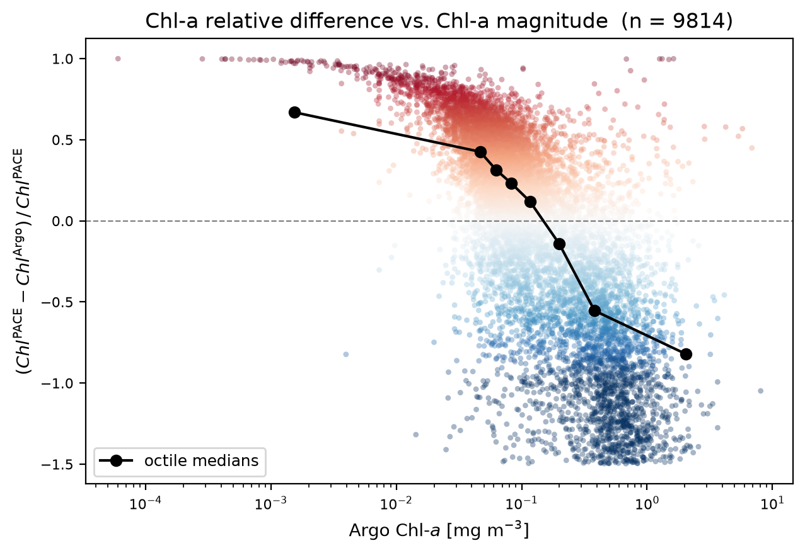

**Key observations:**
- This is the single most important diagnostic in the set: octile-bin medians
  run from about **+0.65** at the lowest Argo Chl-a to about **−0.8** at the
  highest, crossing zero near 0.1–0.2 mg/m³.
- **This concentration-dependence, on its own, rules out a single constant
  multiplicative or additive bias as an adequate description.** Any headline
  "PACE is +13% high" statement is only true near the middle of the
  distribution; PACE reads low in oligotrophic water and high in
  higher-biomass water.
- This is a genuinely different failure mode from bbp700, where the positive
  bias was present at every magnitude sampled (`pace_argo_bbp700_bias_analysis.md`
  Fig. 2) — confirming the Plan's caution not to assume the two retrievals
  share a mechanism.

---

## Figure 4 — Global Distribution

**File:** `chl_global_map.png` (+ `chl_global_map.html`, interactive Bokeh —
kept as an internal artifact only, per the project's Q8 decision; it will not
render inline on GitHub and is not linked here)

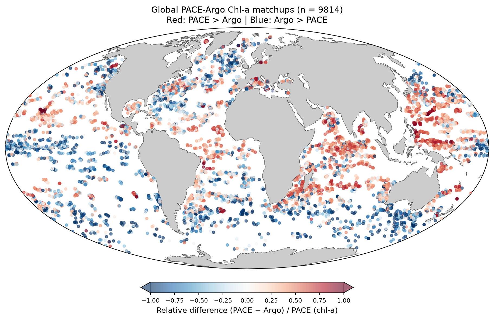

**Key observations:**
- Clear regional structure, unlike bbp700's global-and-uniform bias: red
  (PACE > Argo) dominates the tropical Indo-Pacific, the western tropical
  Atlantic, and coastal/shelf regions; blue (Argo > PACE) dominates the
  Southern Ocean, the subpolar/subtropical North Atlantic and North Pacific,
  and much of the eastern subtropical gyres.
- This spatial pattern is broadly consistent with Figure 3: the blue regions
  are, by and large, lower-Chl-a open-ocean/high-latitude waters, and the red
  regions are higher-Chl-a productive/coastal waters — the concentration
  effect, not an independent geographic effect, is the more likely primary
  driver of what looks like a map pattern.

---

## Figure 5 — Relative Difference vs. Matchup Geometry

**Files:** `chl_reldiff_vs_dtime.png`, `chl_reldiff_vs_dist.png`

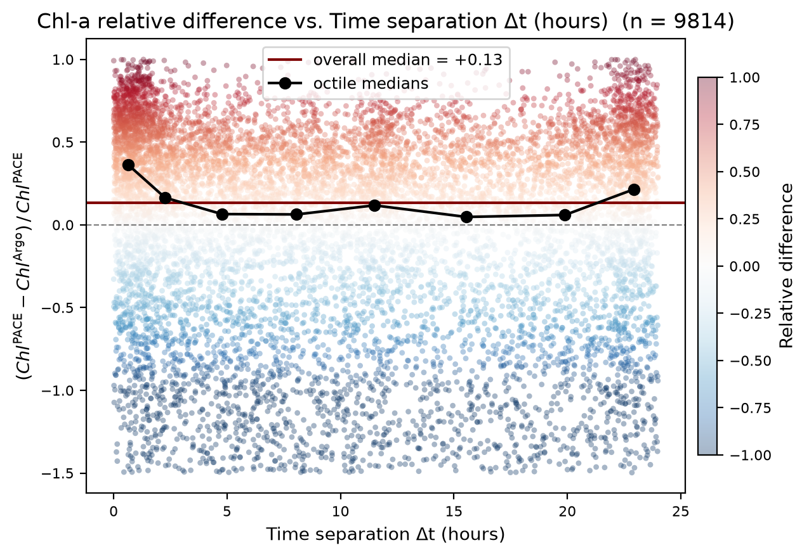
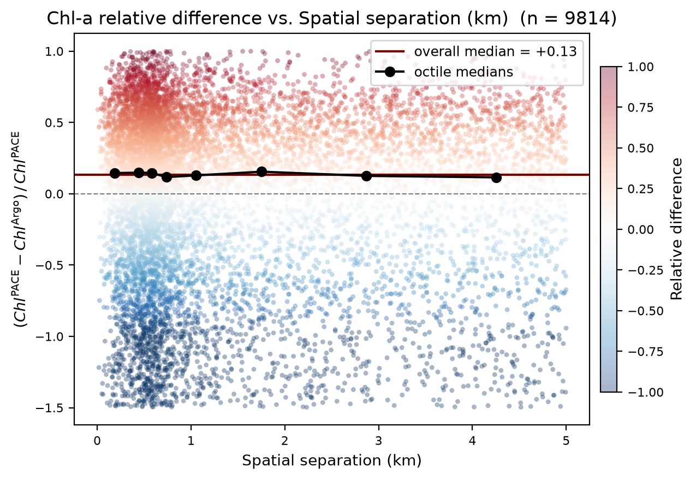

**Key observations:**
- Δt spans the full 0–24 h matching window; octile medians stay within
  roughly +0.05 to +0.35 with no monotonic trend, bracketing the overall
  median of +0.13.
- Distance spans 0.006–5.0 km (median 0.84 km); octile medians are
  essentially flat, all within +0.10 to +0.15.
- As with bbp700, matchup geometry does not drive the bias — the
  concentration-dependence in Figure 3 is not an artifact of loosely matched
  pairs.

---

## Figure 6 — Relative Difference vs. Mixed Layer Depth

**File:** `chl_reldiff_vs_mld.png`

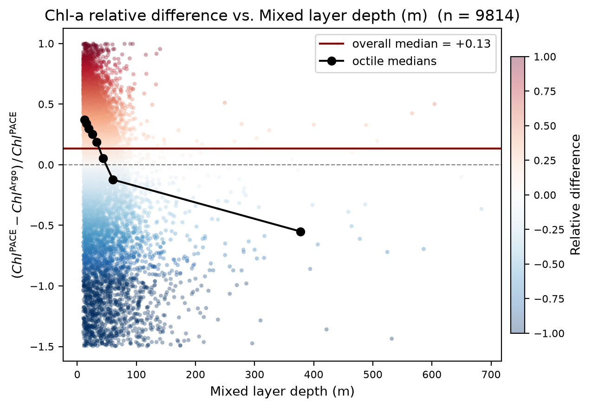

**Key observations:**
- MLD spans a wide range (median 28.8 m, tail out past 500 m); octile medians
  decline from about +0.38 at shallow MLD to about −0.55 at the deepest bin.
- Unlike bbp700 (flat vs. MLD — Fig. 1 of `pace_argo_analysis_figures.md`,
  which argued *against* depth mismatch as the sole driver), Chl-a shows a
  real trend here. **This is very likely a confound, not an independent depth
  effect**: deep mixed layers are disproportionately found in the same
  low-productivity, high-latitude/wintertime regimes that already show low
  Argo Chl-a in Figure 3, and Figure 3's octile spread is larger. Concentration
  is the more parsimonious explanation; depth mismatch (PACE seeing only the
  near-surface optical depth while Argo's mixed-layer mean can extend far
  deeper) remains a plausible contributor but is not established as primary by
  this figure alone.

---

## Figure 7 — Seasonal Cycle

**File:** `chl_reldiff_seasonal.png`

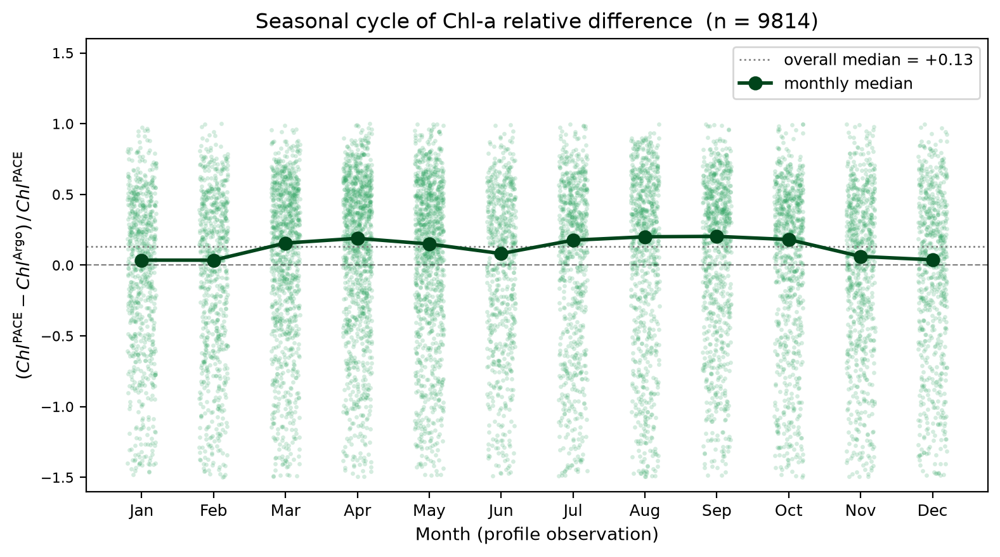

**Key observations:**
- A mild but real seasonal signal: monthly medians run higher (+0.15 to +0.20)
  March–October and lower (+0.03 to +0.09) November–February.
- Weaker than the concentration/basin effects but non-negligible — unlike
  bbp700, which showed no seasonal signal at all
  (`pace_argo_analysis_figures.md` Fig. 2). Plausibly tracks the productivity
  seasonal cycle in the (Northern-Hemisphere-dominated) matchup population
  rather than a PACE- or Argo-specific seasonal artifact, consistent with the
  concentration-dependence already established.

---

## Figure 8 — By Ocean Basin

**File:** `chl_reldiff_by_basin.png`

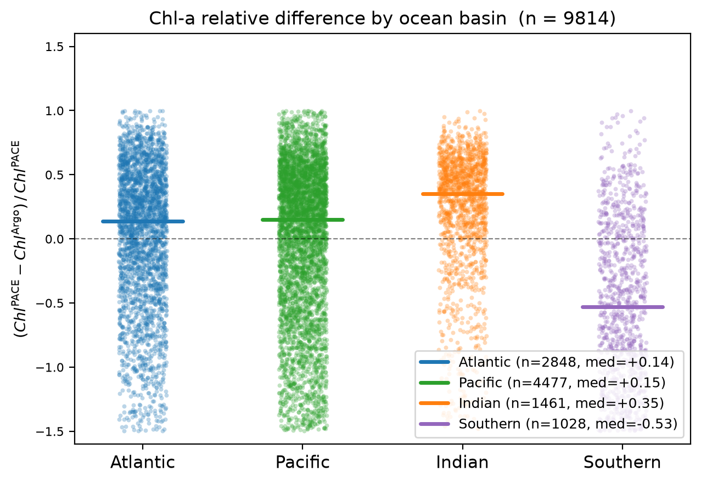

**Key observations:**
- Atlantic (n=2,848, med=+0.14) and Pacific (n=4,477, med=+0.15) sit close to
  the overall median. Indian (n=1,461, med=+0.35) runs notably higher.
- **The Southern Ocean is the outlier: median −0.53 (n=1,028)** — the only
  basin with a *negative* median, and a large deviation from every other
  basin. This is consistent with, and likely explained by, Figure 6: the
  Southern Ocean combines low surface Chl-a with some of the deepest mixed
  layers in the population, both of which independently push toward negative
  rel_diff in Figures 3 and 6. It is not obviously a second, independent
  regional effect.
- As with bbp700, no basin flips the *sign* of the effect seen elsewhere in a
  way inconsistent with the concentration story — the Southern Ocean's
  negative median is the concentration/MLD pattern showing through basin
  stratification, not a new mechanism.

---

## Figure 9 — Data-Quality Stratification

**File:** `chl_reldiff_quality_subset.png`

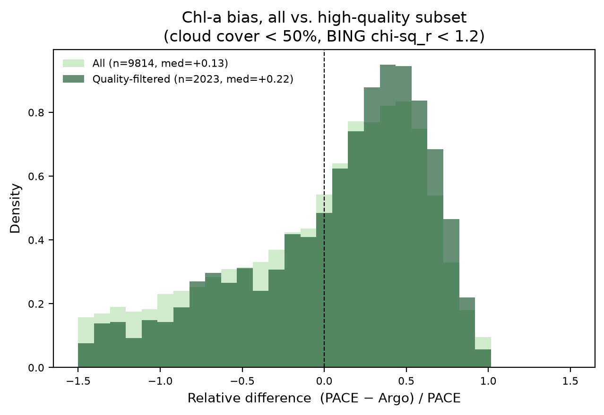

**Key observations:**
- Restricting to granule cloud cover < 50% and BING reduced χ² < 1.2 leaves
  2,023 of 9,814 matchups (21%); the median *increases* from +0.13 to +0.22.
- This mirrors the bbp700 clean-subset finding (+0.35 → +0.49,
  `pace_argo_bbp700_clean_subset.md`), if more modestly: **the highest-quality
  PACE retrievals show a somewhat larger, not smaller, median bias.** Poor
  PACE data quality is not the source of the positive tail, for either
  quantity.
- The quality filter does not, however, remove the negative tail visible in
  the histogram overlay — it shifts the whole distribution's center slightly
  right without resolving the underlying concentration-dependent sign flip.

---

## Figure 10 — By Argo Data Mode

**File:** `chl_reldiff_by_data_mode.png`

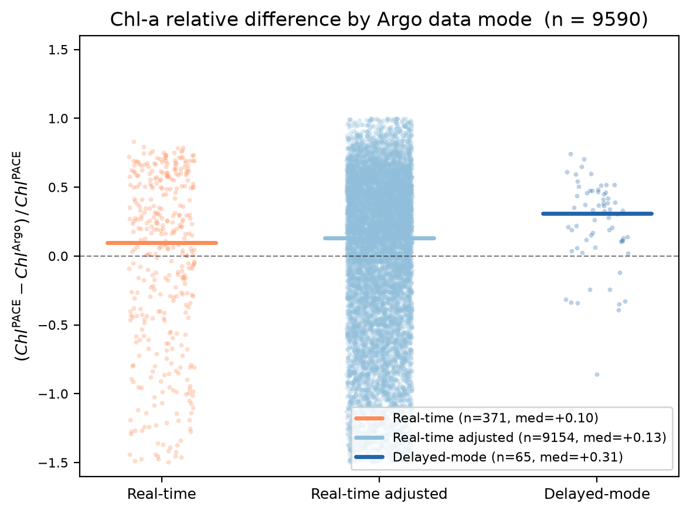

**Key observations:**
- Stratifying by the per-parameter `chla_data_mode` (populated for the first
  time by the Stage 10 pass; the coarse whole-profile `profiles.data_mode` it
  replaces is NULL for essentially all BGC profiles, per
  `chl_cdom_prompt_1.md`): real-time n=371 (med +0.10), real-time-adjusted
  n=9,154 (med +0.13), delayed-mode n=65 (med +0.31).
- The delayed-mode subset — Argo's most thoroughly quality-controlled stream
  — shows the highest median, in the same direction as the quality-subset
  result in Figure 9. However n=65 is under 1% of the sample; this is a
  suggestive, not confirmed, trend.

---

## Figure 11 — Correlation with the bbp700 Retrieval Bias

**File:** `chl_bias_vs_bbp_bias.png`

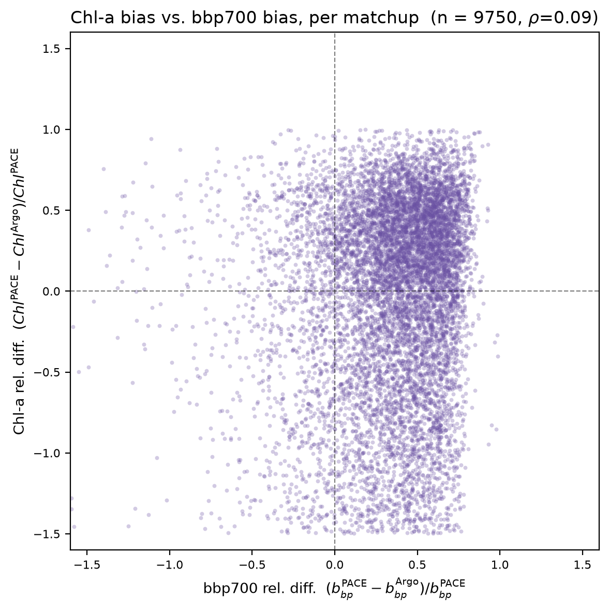

**Key observations:**
- Essentially no correlation (Spearman ρ = 0.09, n=9,750) between a
  matchup's Chl-a relative difference and its bbp700 relative difference from
  the same BING fit.
- **The two retrieval biases are not a shared-pipeline artifact.** Whatever
  drives bbp700's well-established positive offset (leading hypothesis:
  depth mismatch between PACE's near-surface sensitivity and Argo's
  mixed-layer average) is largely independent of whatever drives the Chl-a
  bias documented here.

---

## Figure 12 — Correlation with the Fitted CDOM/Detrital Amplitude

**File:** `chl_reldiff_vs_adg.png`

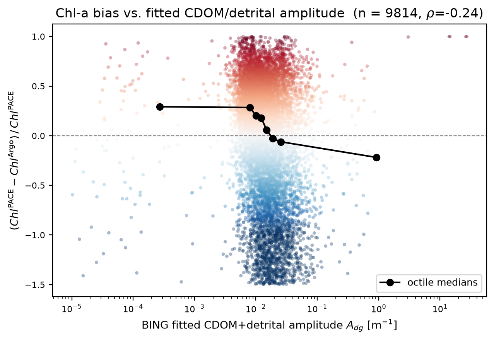

**Key observations:**
- A modest negative correlation (Spearman ρ = −0.24, n=9,814): higher fitted
  `BING_ExpBPow_Adg` (the combined CDOM+detrital absorption amplitude) goes
  with a lower (more negative) Chl-a bias — octile medians cross from
  positive to negative as `Adg` rises through its middle range.
- This is **consistent with, but does not prove**, the CDOM/detrital-aliasing
  hypothesis from the Plan: in high-`Adg` water, some of the absorption BING
  would otherwise attribute to the phytoplankton (`Aph`, → Chl) term may
  instead be captured by the `Adg` term, suppressing the Chl retrieval. The
  companion CDOM analysis (see the separate CDOM report) found essentially no
  rank correlation between *in-situ* CDOM and `Adg` itself, so this pattern
  is about the fitted `Adg` amplitude specifically, not a validated physical
  CDOM signal.

---

## Figure 13 — In-Situ Reference: Raw vs. Adjusted Argo Chl-a

**Files:** `chl_raw_vs_adjusted_argo.png`, `chl_bias_raw_vs_adjusted.png`

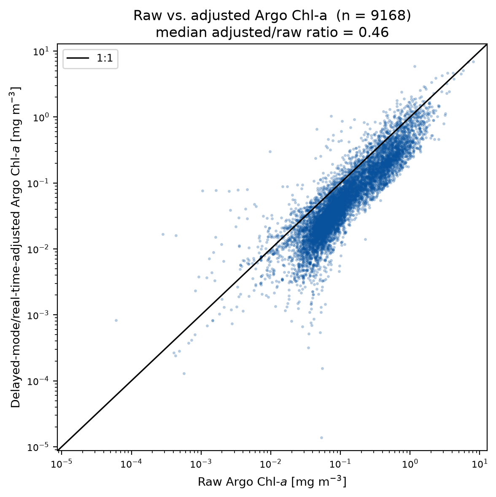
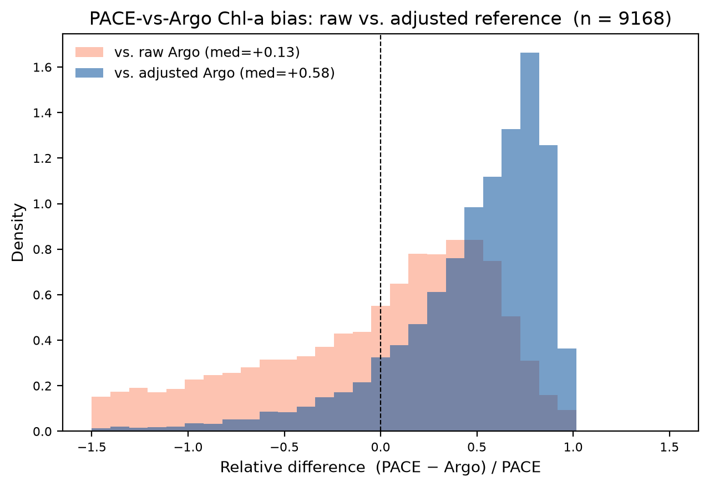

**Key observations:**
- The delayed-mode/real-time-adjusted Argo Chl-a (`chla_adjusted`, added by
  the Stage 10 pass; populated for 9,168 of 9,814 valid matchups, 93.4%) runs
  substantially below the raw value used throughout this report's other
  figures: median adjusted/raw ratio **0.46**.
- Recomputing the PACE-vs-Argo bias against the adjusted reference on the
  same 9,168-matchup population shifts the median from **+0.13 (raw) to
  +0.58 (adjusted)** — the single largest swing produced by any
  stratification in this report, larger than the DAC gap, the basin spread,
  or the quality-filter shift.
- **This is not a resolved question — it is the report's central caveat.**
  PAB's production matchups compare PACE against *raw* Chl-a by design
  (`argo_mode="expert"`, chosen because the alternative modes return no data
  for many real-time profiles — see `chl_cdom_matchups.md`'s provenance
  investigation). The delayed-mode adjustment is generally understood to
  correct for non-photochemical quenching (NPQ) suppression of daytime
  fluorescence near the surface, which would make the adjusted value the more
  physically appropriate reference — but PAB does not currently ingest the
  per-profile calibration metadata (`SCIENTIFIC_CALIB_*`) needed to confirm
  which correction algorithm, if any, a given DAC actually applied. Every
  bias number in this report (headline +0.13, DAC split, basin split, etc.)
  is implicitly a statement about *raw* Argo Chl-a; against the adjusted
  reference, the PACE retrieval would look considerably more biased high.

---

## Figure 14 — By Processing DAC

**Files:** `chl_reldiff_by_dac_aoml.png`, `chl_reldiff_by_dac_all.png`

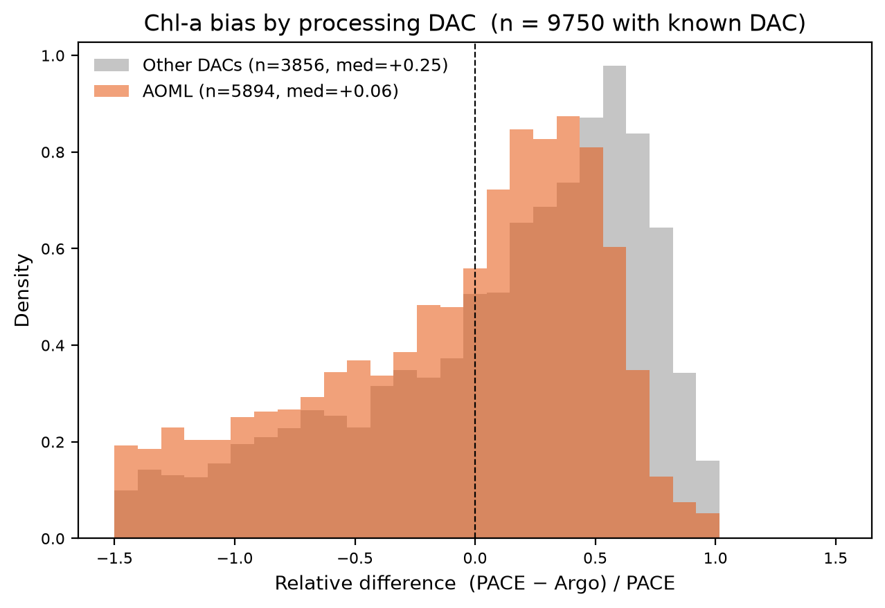
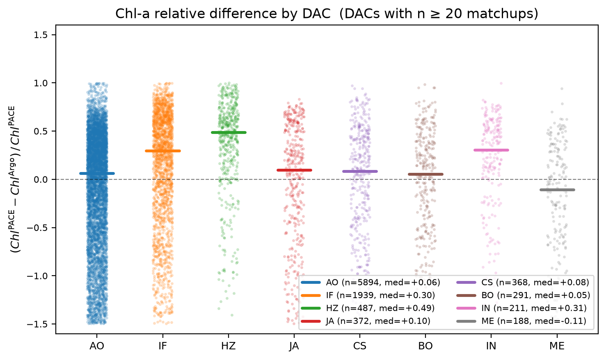

**Key observations:**
- `floats.data_center`, populated for the first time by the Stage 10 pass, is
  known for 9,750 of 9,814 valid matchups (99.3%). AOML dominates
  (5,894 matchups, 60%), followed by Coriolis/`IF` (1,939), then smaller
  contributions from HZ/CHINA-ARGO, JA/JMA, CS/CSIRO, BO/BODC, IN/INCOIS, and
  ME/MEDS.
- **AOML shows a materially smaller median bias (+0.06) than every other DAC
  combined (+0.25).** Given AOML's dominant share, this is not a small-n
  artifact.
- Per-DAC panel (`chl_reldiff_by_dac_all.png`) shows the other DACs are not
  uniform either — some run higher still than the pooled "other" figure.
  Since delayed-mode processing conventions (Figure 13's caveat) are DAC-run,
  not centralized, a plausible contributor to the DAC spread is
  calibration/QC-convention heterogeneity across DACs rather than a PACE
  effect that depends on which DAC processed the float — though this
  analysis cannot separate that from any genuine regional confound (AOML
  floats are not uniformly distributed across ocean basins either).

---

## Interpretation

1. **The bias signature is real, modest in aggregate, and fundamentally
   concentration-dependent — not a constant offset.** Octile medians run from
   roughly +0.65 at the lowest Argo Chl-a to roughly −0.8 at the highest
   (Figure 3). This is the headline finding of the whole analysis: any single
   "PACE is +X% biased" statement misrepresents the population.

2. **The in-situ reference is the largest source of ambiguity in this
   analysis, and is treated accordingly here rather than in a footnote.**
   Switching from raw to delayed-mode-adjusted Argo Chl-a — a choice PAB's
   current pipeline does not make, by design, for data-availability reasons —
   moves the median bias from +0.13 to +0.58 (Figure 13), a larger shift than
   any geometric, seasonal, basin, or quality stratification in this report.
   Compounding this, PAB cannot currently verify *which* correction a given
   DAC applied (no `SCIENTIFIC_CALIB_*` provenance is ingested), so neither
   "raw" nor "adjusted" is an unambiguous ground truth. Resolving this — most
   directly by ingesting the calibration metadata and/or consulting BGC-Argo
   experts on the correction PAB should treat as authoritative — should be a
   priority before any tighter bias number is quoted publicly.

3. **Matchup geometry and PACE data quality are ruled out as primary
   drivers**, exactly as for bbp700: Δt and distance octile medians are flat
   (Figure 5), and the highest-quality PACE subset shows a *larger*, not
   smaller, median bias (Figure 9). Whatever drives the bias is not
   attributable to loose matchups or noisy satellite retrievals.

4. **The bbp700 depth-mismatch story does not carry over, as anticipated.**
   The Chl and bbp700 biases from the same BING fits are essentially
   uncorrelated (ρ=0.09, Figure 11) — different mechanisms are at work — and
   the MLD trend that does exist for Chl-a (Figure 6) is more parsimoniously
   explained as a proxy for low-productivity regimes (Figure 3) than as an
   independent optical-depth effect, unlike bbp700's flat MLD relationship.

5. **A modest, physically plausible retrieval-side mechanism exists but is
   not confirmed:** the negative correlation between the Chl bias and the
   fitted `Adg` amplitude (ρ=-0.24, Figure 12) is consistent with
   CDOM/detrital absorption aliasing into the Bricaud phytoplankton term at
   high `Adg`, suppressing the Chl retrieval there. This is a candidate worth
   testing further (e.g., with synthetic BING fits at controlled `Adg`), not
   an established cause.

6. **DAC-of-origin correlates with bias strength (+0.06 AOML vs. +0.25
   elsewhere, Figure 14), plausibly reflecting cross-DAC calibration/QC
   heterogeneity** rather than, or in addition to, a genuine regional
   confound. Combined with point 2, this reinforces that a meaningful share of
   what looks like "PACE bias" in this dataset may be sensitive to Argo-side
   processing choices PAB does not currently control for.

**Net assessment:** PACE Chl-a shows real skill (ρ=0.78 in log-log rank
correlation) but a genuine, concentration-dependent bias whose magnitude is
substantially less certain than a single headline number suggests, once the
raw-vs-adjusted Argo reference question is taken seriously. The CDOM/detrital
aliasing hypothesis and the AOML/DAC pattern are the most promising leads for
a follow-on investigation; matchup geometry and PACE data quality are not.

---

## How to Reproduce

```bash
cd /path/to/PAB
conda activate ocean14

# Regenerate every figure in this report and print the headline numbers
python -m pab.matchup.chl.run_all --outdir pab/matchup/chl
```

Each figure can also be regenerated individually, e.g.:

```bash
python -m pab.matchup.chl.plot_chl_scatter --out chl_pace_vs_argo_scatter.png
python -m pab.matchup.chl.plot_chl_stratification --outdir .
python -m pab.matchup.chl.plot_chl_adjusted --outdir .
python -m pab.matchup.chl.plot_chl_dac --outdir .
```

All scripts accept `--db` to point at a different `pab.db` (default:
`$PAB_DATA_DIR/pab.db`, via `pab.config.DATA_DIR`). The interactive Bokeh map
(`chl_global_map.html`) requires network access to load its CartoDB basemap
tile at view time; the underlying matchup data is embedded in the file.

---

## Notes

- All scripts are in `pab/matchup/chl/`, built on a shared loader
  (`data.py::load_chl_matchups()`) so every figure draws from one
  consistently-joined dataframe.
- The bbp700-precedent outlier screen (`|rel_diff| ≤ 1.5`) is applied
  throughout; matchups outside it are a small fraction of the sample and are
  not examined separately here.
- This report answers Q10's deferred "second pass" quantification (does the
  missing Chl-a correction matter for the observed bias — yes, substantially)
  but does not resolve which correction PAB should adopt going forward; see
  Interpretation point 2.
- The CDOM comparison (Argo CDOM vs. the fitted `Adg` amplitude) is reported
  separately, per C1–C4 of `chl_cdom_matchups.md` — it is qualitative/
  correlative only and not comparable in kind to the bias figures here.
- This is an internal deep-dive; the RTD-published `summary` report page
  carries a lighter aggregate Chl-a scatter and is not superseded by this
  document.
